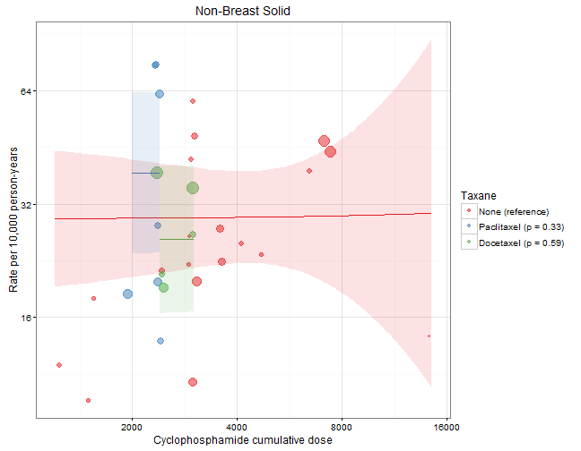

# Risks of Long-term Secondary Malignancies in Breast Cancer Patients Treated with Adjuvant Chemotherapy

* Author: [Benjamin Chan](http://careers.stackoverflow.com/benjaminchan)
* Date: 2017-03-24 10:18:54


# Load packages


```r
library(openxlsx)
library(data.table)
library(tidyr)
```

---

# Load data

Load the data from [GitHub](https://github.com/benjamin-chan/SecMalAfterBreastCaACT).


```r
repo <- "https://github.com/benjamin-chan/SecMalAfterBreastCaACT"
url <- paste0(repo, "/raw/26115dab1eb2b075d40f545514a03c3b30cde6b4/SecondaryMalignancies_Data_BG_3_4.xlsx")
f <- tempfile()
download.file(url, f, mode="wb")
file.info(f)[c("size", "mtime")]
```

```
##                                                                        size
## C:\\Users\\chanb\\AppData\\Local\\Temp\\1\\RtmpUZfE01\\file34c326883a 59619
##                                                                                     mtime
## C:\\Users\\chanb\\AppData\\Local\\Temp\\1\\RtmpUZfE01\\file34c326883a 2017-03-24 10:18:55
```

```r
sheets <- getSheetNames(f)
# sheets
D <- read.xlsx(f, sheet = sheets[1], startRow = 3, colNames = FALSE)
D <- data.table(D)
oldnames <- names(D)
newnames <- c("id",
              "authorYear",
              "trial",
              "quality",
              "arm",
              "nRandomized",
              "nITT",
              # "pctCompletingTx",
              "medianFU",
              "regimen",
              "anthracyclineType",
              "anthracyclineTotalDose",
              "anthracyclineDuration",
              "anthracyclineCourses",
              "cyclophosphamideDose",
              "cyclophosphamideDuration",
              "cyclophosphamideCourses",
              "taxaneType",
              "taxaneTotalDose",
              "taxaneDuration",
              "taxaneCourses",
              "fluoroucilTotalDose",
              "fluoroucilDuration",
              "fluoroucilCourses",
              "otherTxDetails",
              "malAML",
              "malMDS",
              "malAMLOrMDS",
              "malNonBreastSolid",
              "malNonBreastSolidType",
              "malOtherBloodCancers",
              "malSMRelatedDeaths",
              "malSecondPrimary",
              "NOTES")
setnames(D, oldnames, newnames[1:33])
```

# Tidy data

Create a `rowid` variable.
This will be handy later.


```r
D <- D[, rowid := .I]
```

Fix some minor data entry inconsistencies.


```r
D <- D[grep("Nitz", authorYear), authorYear := gsub("2014$", "2014)", authorYear)]
D <- D[grep("Wolmark", authorYear), authorYear := gsub(", 2001$", " (2001)", authorYear)]
```

Input missing data for Bergh (2000); row was split.


```r
col <- grep("^cyclophosphamide", names(D), invert = TRUE)
D[11, col] <- D[10, col, with = FALSE]
# D[11, ]
# D[10, ]
```

Fix trial column for Romond (2005).


```r
D <- D[grep("Romond", authorYear), trial := gsub("&N", "& N", trial)]
```

Make `medianFU` numeric.


```r
D <- D[grep("-", medianFU, invert = TRUE), medianFUNum := round(as.numeric(medianFU), digits = 2)]
x <- D[grep("-", medianFU), medianFU]
x <- as.numeric(unlist(strsplit(x, "-")))
x1 <- x[seq(1, length(x), 2)]
x2 <- x[seq(2, length(x), 2)]
xbar <- rowMeans(cbind(x1, x2))
D <- D[grep("-", medianFU), medianFUNum := xbar]
D <- D[,
       `:=` (medianFUChar = medianFU,
             medianFU = medianFUNum,
             medianFUNum = NULL)]
unique(D[as.character(medianFU) != medianFUChar, .(medianFU, medianFUChar)])
```

```
##    medianFU       medianFUChar
## 1:     38.3 38.299999999999997
## 2:     73.0              71-75
## 3:     99.6 99.600000000000009
## 4:     28.8 28.799999999999997
```

```r
D <- D[, medianFUChar := NULL]
```

Recode mal* values of `NR` and `-` to `NA`.


```r
recode <- function(x) {
    missval <- c("-", "NR", " ")
    vec <- D[, get(x)]
    vec[vec %in% missval] <- NA
    vec
}
col <- grep("^mal", names(D), value = TRUE)
for (i in 1:length(col)) {
    D[, col[i]] <- recode(col[i])
}
```

Substitute non-numeric text in mal* values.


```r
substitute <- function(x) {
    vec <- D[, get(x)]
    vec <- gsub("[[:alpha:]]", "", vec)
    vec
}
col <- grep("^mal", names(D), value = TRUE)
for (i in 1:4) {
    # Only substitute a subset of mal* columns
    D[, col[i]] <- substitute(col[i])
}
```

Convert mal* values to numeric.


```r
for (i in 1:4) {
    # Only convert a subset of mal* columns
    D <- D[, col[i] := as.numeric(get(col[i]))]
}
```

The `malAMLOrMDS` column, as entered, captures number of AML or MDS malignancies if the study reported them grouped as opposed to separately.
If the study reported them as separately, then these counts are captures in the `malAML` and `malMDS` columns.
I.e., the `malAML`, `malMDS`, and `malAMLOrMDS` columns are mutually exclusive counts.
We want to create another column, `malAMLOrMDSTotal`, to be non-mutually exclusive from `malAML`, `malMDS`, and `malAMLOrMDS`.
If none of the `malAML`, `malMDS`, and `malAMLOrMDS` values are populated, then set `malAMLOrMDSTotal` to `NA`, also.
NOTE: Couldn't get this to work: [http://stackoverflow.com/a/16513949/1427069](http://stackoverflow.com/a/16513949/1427069).


```r
s <- sample(D[, rowid], 12)
malAMLOrMDSTotal <- rowSums(D[, .(malAML, malMDS, malAMLOrMDS)], na.rm=TRUE)
D <- D[, malAMLOrMDSTotal := malAMLOrMDSTotal]
D <- D[is.na(malAML) & is.na(malMDS) & is.na(malAMLOrMDS), malAMLOrMDSTotal := NA]
D[s, .(rowid, malAML, malMDS, malAMLOrMDS, malAMLOrMDSTotal)]
```

```
##     rowid malAML malMDS malAMLOrMDS malAMLOrMDSTotal
##  1:    83     NA     NA           5                5
##  2:    34      0      1          NA                1
##  3:    51     NA     NA          NA               NA
##  4:    53      1      0          NA                1
##  5:    33      0      0          NA                0
##  6:    86     NA     NA           5                5
##  7:    48     NA     NA          NA               NA
##  8:    49     NA     NA          NA               NA
##  9:    46      2      0          NA                2
## 10:    40      2     NA          NA                2
## 11:    55      4      2          NA                6
## 12:    41      1     NA          NA                1
```

Remove text from `nITT` column.


```r
D <- D[authorYear == "Misset (1996)" & arm == 2, nITT := "137"]
D <- D[authorYear == "Fumoleu (2003)" & arm == 1, nITT := "210"]
D <- D[authorYear == "Fumoleu (2003)" & arm == 2, nITT := "197"]
D <- D[authorYear == "Fumoleu (2003)" & arm == 3, nITT := "195"]
D <- D[, nITT := as.integer(nITT)]
```

Clean up the `regimen` and `dose` columns.
Output to [regimens.md](regimens.md) for checking.


```r
D <- D[, regimen := gsub("\\s$", "", regimen)]
D <- D[, regimen := gsub("\\r*\\n", " ", regimen)]
doseVar <- grep("dose", names(D), ignore.case = TRUE, value = TRUE)
for (i in 1:length(doseVar)) {
    D <- D[, doseVar[i] := gsub("\\r*\\n", " ", get(doseVar[i]))]
}
cat(kable(D[, .N, c("regimen", doseVar), with = TRUE][order(regimen)]),
    file = "regimens.md",
    sep = "\n")
file.info("regimens.md")
```

```
##             size isdir mode               mtime               ctime
## regimens.md 7280 FALSE  666 2017-03-24 10:18:56 2016-10-07 11:24:23
##                           atime exe
## regimens.md 2016-10-07 11:24:23  no
```

Calculate cumulative dose: $\text{total dose} \times \text{number of courses}$.


```r
D <- D[, anthracyclineTotalDose := as.numeric(anthracyclineTotalDose)]
```

```
## Warning: NAs introduced by coercion
```

```r
D <- D[authorYear == "Bergh (2000)" & regimen == "FEC\nTailored", anthracyclineTotalDose := 75]
D <- D[authorYear == "Henderson (2003)", anthracyclineTotalDose := 75]
D <- D[authorYear == "Colleoni (2009)" & regimen == "AC-CMF", anthracyclineTotalDose := 75]
D <- D[, cyclophosphamideDose := as.numeric(cyclophosphamideDose)]
```

```
## Warning: NAs introduced by coercion
```

```r
D <- D[authorYear == "Colleoni (2009)" & regimen == "EC", cyclophosphamideDose := 600]
D <- D[authorYear == "Bergh (2000)" & regimen == "FEC\nTailored", cyclophosphamideDose := 900]
D <- D[authorYear == "Henderson (2003)", anthracyclineTotalDose := 75]
D <- D[, taxaneCourses := as.numeric(taxaneCourses)]
```

```
## Warning: NAs introduced by coercion
```

```r
D <- D[authorYear == "Shulman (2014)" & regimen == "T" & arm == 3, taxaneCourses := 4]
D <- D[authorYear == "Shulman (2014)" & regimen == "T" & arm == 4, taxaneCourses := 6]
D <- D[, fluoroucilTotalDose := as.numeric(fluoroucilTotalDose)]
```

```
## Warning: NAs introduced by coercion
```

```r
D <- D[authorYear == "Bergh (2000)" & regimen == "FEC\nTailored", fluoroucilTotalDose := 600]
D <- D[authorYear == "Joensuu (2012)" & regimen == "TX-CEX", fluoroucilTotalDose := NA]
D <- D[!is.na(anthracyclineTotalDose) & !is.na(anthracyclineTotalDose),
       anthracyclineCumulDose := anthracyclineTotalDose * anthracyclineCourses]
D <- D[!is.na(cyclophosphamideDose) & !is.na(cyclophosphamideCourses),
       cyclophosphamideCumulDose := cyclophosphamideDose * cyclophosphamideCourses]
D <- D[!is.na(as.numeric(taxaneTotalDose)) & !is.na(taxaneCourses),
       taxaneCumulDose := as.numeric(taxaneTotalDose) * taxaneCourses]
D <- D[!is.na(fluoroucilTotalDose) & !is.na(fluoroucilCourses),
       fluoroucilCumulDose := fluoroucilTotalDose * fluoroucilCourses]
# D <- D[is.na(anthracyclineCumulDose), anthracyclineCumulDose := 0]
# D <- D[is.na(cyclophosphamideCumulDose), cyclophosphamideCumulDose := 0]
# D <- D[is.na(taxaneCumulDose), taxaneCumulDose := 0]
# D <- D[is.na(fluoroucilCumulDose), fluoroucilCumulDose := 0]
```

Check.


```r
head(D[!is.na(anthracyclineCumulDose),
       .(authorYear, regimen, anthracyclineCumulDose, anthracyclineTotalDose, anthracyclineCourses)])
```

```
##       authorYear regimen anthracyclineCumulDose anthracyclineTotalDose
## 1: Fisher (1990)      AC                    240                     60
## 2: Fisher (1990)  AC-CMF                    240                     60
## 3: Misset (1996)    AVCF                    360                     30
## 4: Fisher (1999)      AC                    240                     60
## 5: Fisher (1999)      AC                    240                     60
## 6: Fisher (1999)      AC                    240                     60
##    anthracyclineCourses
## 1:                    4
## 2:                    4
## 3:                   12
## 4:                    4
## 5:                    4
## 6:                    4
```

```r
head(D[!is.na(cyclophosphamideCumulDose),
       .(authorYear, regimen, cyclophosphamideCumulDose, cyclophosphamideDose, cyclophosphamideCourses)])
```

```
##       authorYear regimen cyclophosphamideCumulDose cyclophosphamideDose
## 1: Fisher (1990)      AC                      2400                  600
## 2: Fisher (1990)  AC-CMF                      2400                  600
## 3: Misset (1996)    AVCF                     14400                 1200
## 4: Fisher (1999)      AC                      4800                 1200
## 5: Fisher (1999)      AC                      4800                 2400
## 6: Fisher (1999)      AC                      9600                 2400
##    cyclophosphamideCourses
## 1:                       4
## 2:                       4
## 3:                      12
## 4:                       4
## 5:                       2
## 6:                       4
```

```r
head(D[!is.na(taxaneCumulDose),
       .(authorYear, regimen, taxaneCumulDose, taxaneTotalDose, taxaneCourses)])
```

```
##        authorYear regimen taxaneCumulDose taxaneTotalDose taxaneCourses
## 1:  Citron (2003)   A-T-C             700             175             4
## 2:  Citron (2003)   A-T-C             700             175             4
## 3:  Citron (2003)    AC-T             700             175             4
## 4:  Citron (2003)    AC-T             700             175             4
## 5: Francis (2008) A-T-CMF             300             100             3
## 6: Francis (2008)  AT-CMF             300              75             4
```

```r
head(D[!is.na(fluoroucilCumulDose),
       .(authorYear, regimen, fluoroucilCumulDose, fluoroucilTotalDose, fluoroucilCourses)])
```

```
##          authorYear regimen fluoroucilCumulDose fluoroucilTotalDose
## 1:    Misset (1996)    AVCF               19200                1600
## 2: Venturini (2005)     FEC                3600                 600
## 3: Venturini (2005)     FEC                3600                 600
## 4:    Martin (2010)     FAC                3000                 500
## 5:     Roche (2006)     FEC                3000                 500
## 6:     Roche (2006)   FEC-T                1500                 500
##    fluoroucilCourses
## 1:                12
## 2:                 6
## 3:                 6
## 4:                 6
## 5:                 6
## 6:                 3
```

## Manual tidying

After an early round of analysis, we realized there were some `nITT` data entry errors in the commit [26115da](https://github.com/benjamin-chan/SecMalAfterBreastCaACT/raw/26115dab1eb2b075d40f545514a03c3b30cde6b4/SecondaryMalignancies_Data_BG_3_4.xlsx) (Jun 1, 2016) spreadsheet.


```r
D <- D[authorYear == "Mamounas (2005)" & nITT == 1528, `:=` (nITTOld = nITT, nITT = 1529, isFixed = TRUE)]
D <- D[authorYear == "Fumoleu (2003)" & nITT == 210, `:=` (nITTOld = nITT, nITT = 212, isFixed = TRUE)]
D <- D[authorYear == "Fumoleu (2003)" & nITT == 197, `:=` (nITTOld = nITT, nITT = 209, isFixed = TRUE)]
D <- D[authorYear == "Fumoleu (2003)" & nITT == 195, `:=` (nITTOld = nITT, nITT = 200, isFixed = TRUE)]
D <- D[authorYear == "Fargeot (2004)" & nITT == 155, `:=` (nITTOld = nITT, nITT = 164, isFixed = TRUE)]
D <- D[authorYear == "Fargeot (2004)" & nITT == 163, `:=` (nITTOld = nITT, nITT = 174, isFixed = TRUE)]
D <- D[authorYear == "Kerbrat (2007)" & nITT == 235, `:=` (nITTOld = nITT, nITT = 241, isFixed = TRUE)]
D <- D[authorYear == "Kerbrat (2007)" & nITT == 236, `:=` (nITTOld = nITT, nITT = 241, isFixed = TRUE)]
D <- D[authorYear == "Fisher (1997)" & nITT == 763, `:=` (nITTOld = nITT, nITT = 767, isFixed = TRUE)]
D <- D[authorYear == "Fisher (1997)" & nITT == 771, `:=` (nITTOld = nITT, nITT = 772, isFixed = TRUE)]
D <- D[authorYear == "Bonneterre (2005)" & nITT == 271, `:=` (nITTOld = nITT, nITT = 289, isFixed = TRUE)]
D <- D[authorYear == "Bonneterre (2005)" & nITT == 266, `:=` (nITTOld = nITT, nITT = 276, isFixed = TRUE)]
D <- D[authorYear == "Roche (2006)" & nITT == 163, `:=` (nITTOld = nITT, nITT = 164, isFixed = TRUE)]
D <- D[authorYear == "Roche (2006)" & nITT == 168, `:=` (nITTOld = nITT, nITT = 169, isFixed = TRUE)]
D <- D[authorYear == "Shulman (2014)" & nITT == 1107, `:=` (nITTOld = nITT, nITT = 1142, isFixed = TRUE)]
D <- D[authorYear == "Shulman (2014)" & nITT ==  766, `:=` (nITTOld = nITT, nITT =  789, isFixed = TRUE)]
D <- D[authorYear == "Shulman (2014)" & nITT == 1119, `:=` (nITTOld = nITT, nITT = 1151, isFixed = TRUE)]
D <- D[authorYear == "Shulman (2014)" & nITT ==  782, `:=` (nITTOld = nITT, nITT =  789, isFixed = TRUE)]
D <- D[authorYear == "Swain (2013)" & nITT == 1617, `:=` (nITTOld = nITT, nITT = 1630, isFixed = TRUE)]
D <- D[authorYear == "Swain (2013)" & nITT == 1624, `:=` (nITTOld = nITT, nITT = 1634, isFixed = TRUE)]
D <- D[authorYear == "Swain (2013)" & nITT == 1618, `:=` (nITTOld = nITT, nITT = 1630, isFixed = TRUE)]
D[isFixed == TRUE, .(authorYear, regimen, nITTOld, nITT)]
```

```
##            authorYear   regimen nITTOld nITT
##  1:   Mamounas (2005)        AC    1528 1529
##  2:    Fumoleu (2003)    FEC 50     210  212
##  3:    Fumoleu (2003)  3 FEC 50     197  209
##  4:    Fumoleu (2003)    FEC 75     195  200
##  5:    Fargeot (2004) Tamoxifen     155  164
##  6:    Fargeot (2004)   EPI-Tam     163  174
##  7:    Kerbrat (2007)       FEC     235  241
##  8:    Kerbrat (2007)     E+Vnr     236  241
##  9:     Fisher (1997)        AC     763  767
## 10:     Fisher (1997)        AC     771  772
## 11: Bonneterre (2005)    FEC 50     271  289
## 12: Bonneterre (2005)   FEC 100     266  276
## 13:      Roche (2006) Tamoxifen     163  164
## 14:      Roche (2006)       FEC     168  169
## 15:    Shulman (2014)        AC    1107 1142
## 16:    Shulman (2014)        AC     766  789
## 17:    Shulman (2014)         T    1119 1151
## 18:    Shulman (2014)         T     782  789
## 19:      Swain (2013)       ACT    1617 1630
## 20:      Swain (2013)      AC-T    1624 1634
## 21:      Swain (2013)     AC-TG    1618 1630
##            authorYear   regimen nITTOld nITT
```

```r
D <- D[, `:=` (nITTOld = NULL, isFixed = NULL)]
```

We also made the decision to use the AML/MDS outcomes reported in Perez (2011) as the outcomes for Romond (2005) since they study the same cohort. Other edits to *AML or MDS* and *non-breast solid* malignancy outcome were needed, as well.


```r
D <- D[authorYear == "Martin (2010)" & regimen == "TAC",
      `:=` (malAMLOrMDSTotalOld = malAMLOrMDSTotal, malAMLOrMDSTotal = 0, isFixed = TRUE)]
D <- D[authorYear == "Martin (2010)" & regimen == "FAC",
      `:=` (malAMLOrMDSTotalOld = malAMLOrMDSTotal, malAMLOrMDSTotal = 0, isFixed = TRUE)]
D <- D[authorYear == "Romond (2005)" & regimen == "AC-T",
      `:=` (malAMLOrMDSTotalOld = malAMLOrMDSTotal, malAMLOrMDSTotal = 2, isFixed = TRUE)]
D <- D[authorYear == "Romond (2005)" & regimen == "ACT-T-Trast",
      `:=` (malAMLOrMDSTotalOld = malAMLOrMDSTotal, malAMLOrMDSTotal = 1, isFixed = TRUE)]
D <- D[authorYear == "Del Mastro (2015)",
      `:=` (malAMLOrMDSTotalOld = malAMLOrMDSTotal, malAMLOrMDSTotal = 0, isFixed = TRUE)]
D <- D[authorYear == "Del Mastro (2015)" & regimen == "EC-T" & nITT == 502,
      `:=` (malAMLOrMDSTotalOld = malAMLOrMDSTotal, malAMLOrMDSTotal = 2, isFixed = TRUE)]

D <- D[authorYear == "Bernard-Marty (2003)" & regimen == "EC" & nITT == 267,
      `:=` (malNonBreastSolidOld = malNonBreastSolid, malNonBreastSolid = 4, isFixed = TRUE)]
D <- D[authorYear == "Bonneterre (2005)" & regimen == "FEC 50",
      `:=` (malNonBreastSolidOld = malNonBreastSolid, malNonBreastSolid = 11, isFixed = TRUE)]
D <- D[authorYear == "Bonneterre (2005)" & regimen == "FEC 100",
      `:=` (malNonBreastSolidOld = malNonBreastSolid, malNonBreastSolid = 15, isFixed = TRUE)]
D <- D[authorYear == "Citron (2003)" & regimen == "A-T-C" & nITT == 493,
      `:=` (malNonBreastSolidOld = malNonBreastSolid, malNonBreastSolid = 11, isFixed = TRUE)]
D <- D[authorYear == "Citron (2003)" & regimen == "AC-T" & nITT == 495,
      `:=` (malNonBreastSolidOld = malNonBreastSolid, malNonBreastSolid = 11, isFixed = TRUE)]
D <- D[authorYear == "Eiermann (2011)" & regimen == "AC-T",
      `:=` (malNonBreastSolidOld = malNonBreastSolid, malNonBreastSolid = 34, isFixed = TRUE)]
D <- D[authorYear == "Eiermann (2011)" & regimen == "TAC",
      `:=` (malNonBreastSolidOld = malNonBreastSolid, malNonBreastSolid = 31, isFixed = TRUE)]
D <- D[authorYear == "Romond (2005)" & regimen == "AC-T",
      `:=` (malNonBreastSolidOld = malNonBreastSolid, malNonBreastSolid = 13, isFixed = TRUE)]
D <- D[authorYear == "Romond (2005)" & regimen == "ACT-T-Trast",
      `:=` (malNonBreastSolidOld = malNonBreastSolid, malNonBreastSolid = 4, isFixed = TRUE)]

D[isFixed == TRUE,
  .(authorYear, regimen, nITT, malAMLOrMDSTotalOld, malAMLOrMDSTotal, malNonBreastSolidOld, malNonBreastSolid)]
```

```
##               authorYear     regimen nITT malAMLOrMDSTotalOld
##  1: Bernard-Marty (2003)          EC  267                  NA
##  2:        Citron (2003)       A-T-C  493                  NA
##  3:        Citron (2003)        AC-T  495                  NA
##  4:        Martin (2010)         TAC  539                  NA
##  5:        Martin (2010)         FAC  521                  NA
##  6:    Bonneterre (2005)      FEC 50  289                  NA
##  7:    Bonneterre (2005)     FEC 100  276                  NA
##  8:      Eiermann (2011)        AC-T 1649                  NA
##  9:      Eiermann (2011)         TAC 1649                  NA
## 10:        Romond (2005)        AC-T  872                  NA
## 11:        Romond (2005) ACT-T-Trast  864                  NA
## 12:    Del Mastro (2015)        EC-T  545                  NA
## 13:    Del Mastro (2015)       FEC-T  544                  NA
## 14:    Del Mastro (2015)        EC-T  502                   0
## 15:    Del Mastro (2015)       FEC-T  500                  NA
##     malAMLOrMDSTotal malNonBreastSolidOld malNonBreastSolid
##  1:                0                    3                 4
##  2:                3                   10                11
##  3:                2                   10                11
##  4:                0                   NA                 9
##  5:                0                   NA                16
##  6:                1                    9                11
##  7:                1                   12                15
##  8:                2                   NA                34
##  9:                4                   NA                31
## 10:                2                   NA                13
## 11:                1                   NA                 4
## 12:                0                   NA                NA
## 13:                0                   NA                NA
## 14:                2                   NA                NA
## 15:                0                   NA                NA
```

```r
D <- D[, `:=` (malAMLOrMDSTotalOld = NULL, malNonBreastSolidOld = NULL, isFixed = NULL)]
```

Deduplicate.


```r
n0 <- nrow(D)
setkey(D, authorYear, trial, arm)
D <- unique(D)
message(sprintf("Removed %d duplicate row(s) (%.03g%%)", n0 - nrow(D), (n0 - nrow(D)) / n0 * 100))
```

```
## Removed 1 duplicate row(s) (1.03%)
```


Save data.table to file.


```r
f <- "data.RData"
save(D, file = f)
file.info(f)[c("size", "mtime")]
```

```
##            size               mtime
## data.RData 7440 2017-03-24 10:18:57
```

---

# Summarize

Define some functions.


```r
scale <- 1e4
calcPct <- function (x, n) {
  prec <- "%.3g"
  sprintf(paste0(prec, "%%"),
          median(x / n, na.rm = TRUE) * 100)
}
calcRate <- function (x, n, y) {
  prec <- "%.3g"
  py <- scale
  sprintf(paste(prec, "per %s p-y"),
          median(x / (n * (y / 12)), na.rm=TRUE) * py,
          py)
}
```

Summarize the regimens.
Output to [summaryRegimens.md](summaryRegimens.md) for checking.


```r
D <- D[,
       `:=` (isAnthra = !is.na(anthracyclineTotalDose),
             isCyclo = !is.na(cyclophosphamideDose),
             isTaxane = !is.na(taxaneTotalDose),
             isFluoro = !is.na(fluoroucilTotalDose))]
D <- D[isTaxane == TRUE,
       `:=` (isDocetaxel = grepl("doce", tolower(taxaneType)),
             isPaclitaxel = grepl("pacli", tolower(taxaneType)))]
D <- D[isTaxane == FALSE,
       `:=` (isDocetaxel = FALSE,
             isPaclitaxel = FALSE)]
D1 <- melt(D,
           id.vars=c("id", "authorYear", "arm", "regimen",
                     "isAnthra", "anthracyclineCumulDose",
                     "isCyclo", "cyclophosphamideCumulDose",
                     "isTaxane", "taxaneCumulDose", "isDocetaxel", "isPaclitaxel",
                     "isFluoro", "fluoroucilCumulDose",
                     "nITT", "medianFU"),
           measure.vars=c("malAML", "malMDS", "malAMLOrMDSTotal", "malNonBreastSolid"),
           value.name="malN",
           variable.name="malType")
D1 <- D1[, malType := gsub("^mal", "", malType)]
D1 <- D1[, malType := factor(malType,
                             levels=c("AML", "MDS", "AMLOrMDSTotal", "NonBreastSolid"),
                             labels=c("AML", "MDS", "AML or MDS", "Non-Breast Solid"))]
D1 <- D1[, py := nITT * (medianFU / 12)]
D1 <- D1[, rate := malN / py * scale]
summaryRegimens <- D1[,
                      .(totalN = sum(nITT, na.rm = TRUE),
                        totalPersonYears = round(sum(py, na.rm = TRUE)),
                        totalMalignancies = sum(malN, na.rm = TRUE),
                        medianPct = calcPct(malN, nITT),
                        medianRate = calcRate(malN, nITT, medianFU)),
                      .(isAnthra,
                        isCyclo,
                        isTaxane,
                        isFluoro,
                        malType)]
summaryRegimens <- summaryRegimens[order(-isAnthra, -isCyclo, -isTaxane, -isFluoro, malType)]
cat(kable(summaryRegimens),
    file = "summaryRegimens.md",
    sep = "\n")
file.info("summaryRegimens.md")
```

```
##                    size isdir mode               mtime               ctime
## summaryRegimens.md 4658 FALSE  666 2017-03-24 10:18:57 2016-10-07 11:24:23
##                                  atime exe
## summaryRegimens.md 2016-10-07 11:24:23  no
```

---

# Study Characteristics and Outcomes

Populate Appendix Table 1.
Need columns for

* Study
* Country
* Median follow-up (months)
* Regimen name
* Cumulative dose
    * Anthracyclines
    * Cyclophosphamide
    * Taxanes
* N
* Person-years (the denominator for the incidence rate)
* AML/MDS count (the numerator for the incidence rate)
* AML/MDS incidence, per 10,000 person-years
* Non-breast solid count (the numerator for the incidence rate)
* Non-breast solid incidence, per 10,000 person-years

Output to multiple formats:

* Excel workbook, [appendixTableStudyCharacteristicsAndOutcomes.xlsx](appendixTableStudyCharacteristicsAndOutcomes.xlsx)
* CSV file, [appendixTableStudyCharacteristicsAndOutcomes.csv](appendixTableStudyCharacteristicsAndOutcomes.csv)
* Markdown file, [appendixTableStudyCharacteristicsAndOutcomes.md](appendixTableStudyCharacteristicsAndOutcomes.md)


```r
library(xlsx)
```

```
## Loading required package: rJava
```

```
## Loading required package: methods
```

```
## Loading required package: xlsxjars
```

```
## 
## Attaching package: 'xlsx'
```

```
## The following objects are masked from 'package:openxlsx':
## 
##     createWorkbook, loadWorkbook, read.xlsx, saveWorkbook,
##     write.xlsx
```

```r
library(xtable)
T <- D[,
       .(study = ifelse(!is.na(trial), paste(authorYear, trial), authorYear),
         country = NA,
         medianFU = round(medianFU),
         regimen,
         anthrCumulDose = round(anthracyclineCumulDose),
         cycloCumulaDose = round(cyclophosphamideCumulDose),
         taxaneCumulDose = round(taxaneCumulDose),
         nITT,
         py = nITT * (medianFU / 12),
         nAMLOrMDS = malAMLOrMDSTotal,
         incidenceAMLOrMDS = signif(malAMLOrMDSTotal / (nITT * (medianFU / 12)) * scale, digits=3),
         nNonBreastSolid = malNonBreastSolid,
         incidenceNonBreastSolid = signif(malNonBreastSolid / (nITT * (medianFU / 12)) * scale, digits=3))]
write.xlsx(T,
           "appendixTableStudyCharacteristicsAndOutcomes.xlsx",
           row.names=FALSE,
           showNA=FALSE)
write.csv(T,
          "appendixTableStudyCharacteristicsAndOutcomes.csv",
          quote=FALSE,
          row.names=FALSE)
cat(kable(T),
    file = "appendixTableStudyCharacteristicsAndOutcomes.md",
    sep = "\n")
file.info(grep("appendixTableStudyCharacteristicsAndOutcomes", list.files(), value=TRUE))[c("size", "mtime")]
```

```
##                                                    size
## appendixTableStudyCharacteristicsAndOutcomes.csv   7302
## appendixTableStudyCharacteristicsAndOutcomes.md   20678
## appendixTableStudyCharacteristicsAndOutcomes.xlsx  9485
##                                                                 mtime
## appendixTableStudyCharacteristicsAndOutcomes.csv  2017-03-24 10:18:59
## appendixTableStudyCharacteristicsAndOutcomes.md   2017-03-24 10:18:59
## appendixTableStudyCharacteristicsAndOutcomes.xlsx 2017-03-24 10:18:59
```

```r
T <- xtable(T, digits=c(rep(0, ncol(T) - 3), 0, 2, 0, 2))
```

---

# Meta-regression

Estimate meta-regression models for log transformed incidence rate.

Two outcomes are modeled separately.

1. AML or MDS secondary malignancies
1. Non-breast solid secondary malignancies

Cumulative doses are dichotomized into low and high doses.

* Cyclophosphamide
    * $\lt 2400 \frac{\text{mg}}{\text{m}^2}$
    * $\ge 2400 \frac{\text{mg}}{\text{m}^2}$
* Taxane
    * $\lt 500 \frac{\text{mg}}{\text{m}^2}$
    * $\ge 500 \frac{\text{mg}}{\text{m}^2}$


```r
xscale <- 1e3
D2 <- D1[,
         .(id = factor(id),
           authorYear,
           arm,
           regimen,
           isCyclo,
           xCyc = cyclophosphamideCumulDose / xscale,  # scale units
           isCycHighDose = cyclophosphamideCumulDose >= 2400,
           xTax = taxaneCumulDose / 1e2,  # scale units
           isTaxDoseHigh = ifelse(taxaneCumulDose >= 500 & isTaxane == TRUE, TRUE, FALSE),
           isTaxDoseLow = ifelse(taxaneCumulDose < 500 & isTaxane == TRUE, TRUE, FALSE),
           isDocetaxel,
           isPaclitaxel,
           isAnthra,
           isTaxane,
           isNoTaxane = !(isTaxane),
           isFluoro,
           nITT,
           medianFU,
           malType,
           malN,
           py,
           rate)]
D2 <- D2[isTaxane == FALSE, isTaxDoseHigh := FALSE]
D2 <- drop_na(D2, xCyc, isCycHighDose, isDocetaxel, isPaclitaxel)
```

The effect of cyclophosphamide could be due to high dose taxanes in the regimen.

> From: Joy Melnikow [mailto:jamelnikow@ucdavis.edu]   
> Sent: Monday, August 01, 2016 2:47 PM  
> To: Benjamin Chan <chanb@ohsu.edu>  
> Subject: RE: secondary malignancies  
> 
> The one I'm asking about is cyclophosphamide with high dose taxane vs
> cyclophosphamide alone.  I think if it looks like taxane augments the known
> risk of cyclophosphamide this would be an important addition to the
> literature.

The following models are estimated.

1. $$\log \left( \frac{y_i}{t_i} \right) = \beta_0 + \beta_1 x_{1, i} + \beta_2 I_{\text{paclitaxel}, i} + \beta_3 I_{\text{docetaxel}, i} + \sigma_j$$
1. $$\log \left( \frac{y_i}{t_i} \right) = \beta_0 + \beta_1 x_{1, i} + \beta_2 I_{\text{paclitaxel}, i} + \sigma_j$$
1. $$\log \left( \frac{y_i}{t_i} \right) = \beta_0 + \beta_1 x_{1, i} + \beta_2 I_{\text{paclitaxel}, i} + \beta_4 I_{\text{no taxane}, i} + \sigma_j$$
1. $$\log \left( \frac{y_i}{t_i} \right) = \beta_0 + \beta_1 x_{1, i} + \beta_2 I_{\text{paclitaxel}, i} + \gamma x_{1, i} I_{\text{paclitaxel}, i} + \sigma_j$$

where

* $x_{1, i}$ is the cumulative cyclophosphamide dose for the $i$-th treatment arm
* $I_{\text{paclitaxel}, i}$ is an indicator for whether the $i$-th treatment arm included paclitaxel is the regimen
* $I_{\text{docetaxel}, i}$ is an indicator for whether the $i$-th treatment arm included docetaxel is the regimen
* $I_{\text{no taxane}, i}$ is an indicator for whether the $i$-th treatment arm did not include any taxane is the regimen
* $\sigma_j$ is a random effect for the $j$-th study.

Models were estimated using the `rma.mv()` function from the metafor` package for R.


```r
library(metafor)
```

```
## Loading required package: Matrix
```

```
## 
## Attaching package: 'Matrix'
```

```
## The following object is masked from 'package:tidyr':
## 
##     expand
```

```
## Loading 'metafor' package (version 1.9-8). For an overview 
## and introduction to the package please type: help(metafor).
```

```r
citation("metafor")
```

```
## 
## To cite the metafor package in publications, please use:
## 
##   Viechtbauer, W. (2010). Conducting meta-analyses in R with the
##   metafor package. Journal of Statistical Software, 36(3), 1-48.
##   URL: http://www.jstatsoft.org/v36/i03/
## 
## A BibTeX entry for LaTeX users is
## 
##   @Article{,
##     title = {Conducting meta-analyses in {R} with the {metafor} package},
##     author = {Wolfgang Viechtbauer},
##     journal = {Journal of Statistical Software},
##     year = {2010},
##     volume = {36},
##     number = {3},
##     pages = {1--48},
##     url = {http://www.jstatsoft.org/v36/i03/},
##   }
```

Define meta-regression functions.


```r
pvalToChar <- function (p) {
  if (p < 0.001) {
    pvalue <- "p < 0.001"
  } else {
    pvalue <- sprintf("p = %.02g", p)
  }
  pvalue
}
metareg <- function (D) {
  require(metafor)
  xData <- unique(D[, .(xCyc, isCycHighDose, isDocetaxel, isPaclitaxel, malType)])
  D <- escalc("IRLN", xi = malN, ti = py, data = D)
  randomEffect <- list(~ 1 | id)
  M1 <- rma.mv(yi ~ xCyc + isPaclitaxel + isDocetaxel,
               vi,
               random = randomEffect,
               data = D)
  M2 <- rma.mv(yi ~ xCyc + isPaclitaxel,
               vi,
               random = randomEffect,
               data = D)
  M3 <- rma.mv(yi ~ xCyc + isPaclitaxel + isNoTaxane,
               vi,
               random = randomEffect,
               data = D)
  M4 <- rma.mv(yi ~ xCyc + isPaclitaxel + xCyc * isPaclitaxel,
               vi,
               random = randomEffect,
               data = D)
  list(M1 = M1, M2 = M2, M3 = M3, M4 = M4)
}
plotreg <- function (M, D, title) {
  require(ggplot2)
  require(svglite)
  require(RColorBrewer)
  require(data.table)
  D <- data.table(D)
  X <- data.table(M$X)
  X <- unique(X)
  varnames <- names(X)[2:ncol(X)]
  X1 <- data.table(x1 = seq(min(X[isPaclitaxelTRUE == 0 & isDocetaxelTRUE == 0, xCyc]),
                            max(X[isPaclitaxelTRUE == 0 & isDocetaxelTRUE == 0, xCyc]),
                            length.out = 100),
                   x2 = rep(0, 100),
                   x3 = rep(0, 100))
  X2 <- data.table(x1 = seq(min(X[isPaclitaxelTRUE == 1 & isDocetaxelTRUE == 0, xCyc]),
                            max(X[isPaclitaxelTRUE == 1 & isDocetaxelTRUE == 0, xCyc]),
                            length.out = 100),
                   x2 = rep(1, 100),
                   x3 = rep(0, 100))
  X3 <- data.table(x1 = seq(min(X[isPaclitaxelTRUE == 0 & isDocetaxelTRUE == 1, xCyc]),
                            max(X[isPaclitaxelTRUE == 0 & isDocetaxelTRUE == 1, xCyc]),
                            length.out = 100),
                   x2 = rep(0, 100),
                   x3 = rep(1, 100))
  X <- rbindlist(list(X1, X2, X3))
  names(X) <- varnames
  X$xCyc <- round(X$xCyc, digits = 1)
  X <- unique(X)
  yhat <- data.table(malType = mal,
                     X,
                     # variable = "pred",
                     pred = predict(M, as.matrix(X), transf = exp)[["pred"]] * scale)
  ci.lb <- data.table(malType = mal,
                      X,
                      # variable = "ci.lb",
                      ci.lb = predict(M, as.matrix(X), transf = exp)[["ci.lb"]] * scale)
  ci.ub <- data.table(malType = mal,
                      X,
                      # variable = "ci.ub",
                      ci.ub = predict(M, as.matrix(X), transf = exp)[["ci.ub"]] * scale)
  keyvar <- c("malType", "xCyc", "isPaclitaxelTRUE", "isDocetaxelTRUE")
  setkeyv(yhat, keyvar)
  setkeyv(ci.lb, keyvar)
  setkeyv(ci.ub, keyvar)
  yhat <- merge(merge(yhat, ci.lb), ci.ub)
  pvalues <- c(M$pval[grep("TRUE$", row.names(M$b))])
  names(pvalues) <- row.names(M$b)[grep("TRUE$", row.names(M$b))]
  pal <- brewer.pal(ncol(X), name = "Set1")
  D <- D[isPaclitaxel == FALSE & isDocetaxel == FALSE, color := "A"]
  D <- D[isPaclitaxel == TRUE  & isDocetaxel == FALSE, color := "B"]
  D <- D[isPaclitaxel == FALSE & isDocetaxel == TRUE , color := "C"]
  D <- D[, color := factor(color, labels = c("A", "B", "C"))]
  setorder(D, color)
  G <- ggplot(D, aes(x = xCyc * xscale,
                     y = rate + 1/2,
                     size = nITT / min(nITT, na.rm = TRUE),
                     color = color))
  G <- G + geom_point(alpha = 1/2,
                      position = "jitter")
  G <- G + geom_line(data = yhat[isDocetaxelTRUE == 0 & isPaclitaxelTRUE == 0, ],
                     aes(x = xCyc * xscale, y = pred),
                     inherit.aes = FALSE,
                     color = pal[1])
  G <- G + geom_line(data = yhat[isDocetaxelTRUE == 0 & isPaclitaxelTRUE == 1, ],
                     aes(x = xCyc * xscale, y = pred),
                     inherit.aes = FALSE,
                     color = pal[2])
  G <- G + geom_line(data = yhat[isDocetaxelTRUE == 1 & isPaclitaxelTRUE == 0, ],
                     aes(x = xCyc * xscale, y = pred),
                     inherit.aes = FALSE,
                     color = pal[3])
  G <- G + geom_ribbon(data = yhat[isDocetaxelTRUE == 0 & isPaclitaxelTRUE == 0, ],
                       aes(x = xCyc * xscale, ymax = ci.ub, ymin = ci.lb),
                       inherit.aes = FALSE,
                       fill = pal[1],
                       alpha = 1/8)
  G <- G + geom_ribbon(data = yhat[isDocetaxelTRUE == 0 & isPaclitaxelTRUE == 1, ],
                       aes(x = xCyc * xscale, ymax = ci.ub, ymin = ci.lb),
                       inherit.aes = FALSE,
                       fill = pal[2],
                       alpha = 1/8)
  G <- G + geom_ribbon(data = yhat[isDocetaxelTRUE == 1 & isPaclitaxelTRUE == 0, ],
                       aes(x = xCyc * xscale, ymax = ci.ub, ymin = ci.lb),
                       inherit.aes = FALSE,
                       fill = pal[3],
                       alpha = 1/8)
  G <- G + scale_x_log10("Cyclophosphamide cumulative dose",
                         breaks = 1e3 * (2 ^ seq(-1, 6)))
  G <- G + scale_y_log10(sprintf("Rate per %s person-years",
                                 format(scale, big.mark = ",")),
                         breaks = 2 ^ seq(-1, 6))
  G <- G + scale_color_manual("Taxane",
                              values = pal,
                              labels = c("None (reference)",
                                         sprintf("Paclitaxel (%s)",
                                                 pvalToChar(pvalues[grep("Pacli", names(pvalues))])),
                                         sprintf("Docetaxel (%s)",
                                                 pvalToChar(pvalues[grep("Doce", names(pvalues))]))))
  G <- G + scale_size_continuous(guide = FALSE)
  G <- G + labs(title = title)
  G <- G + theme_bw()
  filename <- sprintf("%s_Cyclophosphamide_byTaxane",
                      gsub("(\\s)|(-)", "", title))
  ggsave(filename = sprintf("%s.png", filename), width = 9)
  ggsave(filename = sprintf("%s.svg", filename), width = 9)
  yhat$xCyc <- yhat$xCyc * xscale
  write.csv(D, file = sprintf("%s.csv", filename), row.names = FALSE, quote = FALSE)
  write.csv(yhat, file = sprintf("%s_Pred.csv", filename), row.names = FALSE, quote = FALSE)
  show(file.info(grep(paste0(filename, "(_Pred)*\\."), list.files(), value = TRUE))[c("size", "mtime")])
  G
}
```

## AML/MDS


```r
mal <- "AML or MDS"
D3 <- drop_na(D2[malType == mal], rate, nITT, malType)
M <- metareg(D3)
```

### Findings

* Crude statistics
  * Outcome: AML or MDS
  * Total person-years of follow-up: 261,433
  * Total number of persons (ITT): 44,628
  * Total number of outcomes: 171
  * Number of treatment arms: 56
  * Number of studies: 26
  * Crude incidence rate: 6.54 per 10,000 person-years
* AML or MDS rate had a dose response relationship with cumulative cyclophosphamide dose (M1)
  * AML or MDS rate increased 1.16 times (95% CI: 1.04, 1.29; p = 0.0057) for each 1000 $\text{mg} / \text{m}^2$
* Paclitaxel confounded the cyclophosphamide dose response
  * Compared to no taxane (M1), paclitaxel increased AML or MDS rate by 1.48 times (95% CI: 0.933, 2.33; p = 0.096)
  * Compared to no taxane or docetaxel (M2), paclitaxel increased AML or MDS rate by 1.62 times (95% CI: 1.05, 2.47; p = 0.028)
  * Compared to docetaxel (M3), paclitaxel increased AML or MDS rate by 2.01 times (95% CI: 1.13, 3.57; p = 0.018)
* Paclitaxel did not modify the dose response effect of cyclophosphamide (M4)
  * Interaction term estimate was -0.0476 (95% CI: -1.07, 0.974; p = 0.93)

### M1

* Cyclophosphamide: dose response
* Paclitaxel and docetaxel: confounders

$$\log \left( \frac{y_i}{t_i} \right) = \beta_0 + \beta_1 x_{1, i} + \beta_2 I_{\text{paclitaxel}, i} + \beta_3 I_{\text{docetaxel}, i} + \sigma_j$$


```r
M$M1
```

```
## 
## Multivariate Meta-Analysis Model (k = 56; method: REML)
## 
## Variance Components: 
## 
##             estim    sqrt  nlvls  fixed  factor
## sigma^2    0.0965  0.3106     26     no      id
## 
## Test for Residual Heterogeneity: 
## QE(df = 52) = 56.3932, p-val = 0.3141
## 
## Test of Moderators (coefficient(s) 2,3,4): 
## QM(df = 3) = 12.4683, p-val = 0.0059
## 
## Model Results:
## 
##                   estimate      se      zval    pval    ci.lb    ci.ub
## intrcpt            -7.7560  0.2610  -29.7194  <.0001  -8.2675  -7.2445
## xCyc                0.1503  0.0544    2.7651  0.0057   0.0438   0.2569
## isPaclitaxelTRUE    0.3889  0.2339    1.6626  0.0964  -0.0696   0.8474
## isDocetaxelTRUE    -0.3081  0.2915   -1.0571  0.2905  -0.8794   0.2631
##                      
## intrcpt           ***
## xCyc               **
## isPaclitaxelTRUE    .
## isDocetaxelTRUE      
## 
## ---
## Signif. codes:  0 '***' 0.001 '**' 0.01 '*' 0.05 '.' 0.1 ' ' 1
```

```r
plotreg(M$M1, D3, mal)
```

```
## Loading required package: ggplot2
```

```
## Loading required package: svglite
```

```
## Loading required package: RColorBrewer
```

```
## Saving 9 x 7 in image
## Saving 9 x 7 in image
```

```
##                                              size               mtime
## AMLorMDS_Cyclophosphamide_byTaxane.csv       7779 2017-03-24 10:19:02
## AMLorMDS_Cyclophosphamide_byTaxane.png      83608 2017-03-24 10:19:02
## AMLorMDS_Cyclophosphamide_byTaxane.svg      23726 2017-03-24 10:19:02
## AMLorMDS_Cyclophosphamide_byTaxane_Pred.csv  8439 2017-03-24 10:19:02
```


### M2

* Cyclophosphamide: dose response
* Paclitaxel: confounder

$$\log \left( \frac{y_i}{t_i} \right) = \beta_0 + \beta_1 x_{1, i} + \beta_2 I_{\text{paclitaxel}, i} + \sigma_j$$


```r
M$M2
```

```
## 
## Multivariate Meta-Analysis Model (k = 56; method: REML)
## 
## Variance Components: 
## 
##             estim    sqrt  nlvls  fixed  factor
## sigma^2    0.1079  0.3285     26     no      id
## 
## Test for Residual Heterogeneity: 
## QE(df = 53) = 58.3218, p-val = 0.2861
## 
## Test of Moderators (coefficient(s) 2,3): 
## QM(df = 2) = 10.7316, p-val = 0.0047
## 
## Model Results:
## 
##                   estimate      se      zval    pval    ci.lb    ci.ub
## intrcpt            -7.8677  0.2400  -32.7779  <.0001  -8.3381  -7.3972
## xCyc                0.1610  0.0540    2.9839  0.0028   0.0553   0.2668
## isPaclitaxelTRUE    0.4794  0.2176    2.2029  0.0276   0.0529   0.9060
##                      
## intrcpt           ***
## xCyc               **
## isPaclitaxelTRUE    *
## 
## ---
## Signif. codes:  0 '***' 0.001 '**' 0.01 '*' 0.05 '.' 0.1 ' ' 1
```

### M3

* Cyclophosphamide: dose response
* Paclitaxel and no taxane: confounders

$$\log \left( \frac{y_i}{t_i} \right) = \beta_0 + \beta_1 x_{1, i} + \beta_2 I_{\text{paclitaxel}, i} + \beta_4 I_{\text{no taxane}, i} + \sigma_j$$


```r
M$M3
```

```
## 
## Multivariate Meta-Analysis Model (k = 56; method: REML)
## 
## Variance Components: 
## 
##             estim    sqrt  nlvls  fixed  factor
## sigma^2    0.0965  0.3106     26     no      id
## 
## Test for Residual Heterogeneity: 
## QE(df = 52) = 56.3932, p-val = 0.3141
## 
## Test of Moderators (coefficient(s) 2,3,4): 
## QM(df = 3) = 12.4683, p-val = 0.0059
## 
## Model Results:
## 
##                   estimate      se      zval    pval    ci.lb    ci.ub
## intrcpt            -8.0641  0.2986  -27.0102  <.0001  -8.6493  -7.4789
## xCyc                0.1503  0.0544    2.7651  0.0057   0.0438   0.2569
## isPaclitaxelTRUE    0.6970  0.2939    2.3713  0.0177   0.1209   1.2731
## isNoTaxaneTRUE      0.3081  0.2915    1.0571  0.2905  -0.2631   0.8794
##                      
## intrcpt           ***
## xCyc               **
## isPaclitaxelTRUE    *
## isNoTaxaneTRUE       
## 
## ---
## Signif. codes:  0 '***' 0.001 '**' 0.01 '*' 0.05 '.' 0.1 ' ' 1
```

### M4

* Cyclophosphamide: dose response
* Paclitaxel: effect modifier

$$\log \left( \frac{y_i}{t_i} \right) = \beta_0 + \beta_1 x_{1, i} + \beta_2 I_{\text{paclitaxel}, i} + \gamma x_{1, i} I_{\text{paclitaxel}, i} + \sigma_j$$


```r
M$M4
```

```
## 
## Multivariate Meta-Analysis Model (k = 56; method: REML)
## 
## Variance Components: 
## 
##             estim    sqrt  nlvls  fixed  factor
## sigma^2    0.1108  0.3329     26     no      id
## 
## Test for Residual Heterogeneity: 
## QE(df = 52) = 58.1427, p-val = 0.2595
## 
## Test of Moderators (coefficient(s) 2,3,4): 
## QM(df = 3) = 10.5951, p-val = 0.0141
## 
## Model Results:
## 
##                        estimate      se      zval    pval    ci.lb
## intrcpt                 -7.8684  0.2416  -32.5620  <.0001  -8.3421
## xCyc                     0.1609  0.0545    2.9541  0.0031   0.0542
## isPaclitaxelTRUE         0.5880  1.2258    0.4797  0.6314  -1.8145
## xCyc:isPaclitaxelTRUE   -0.0476  0.5214   -0.0912  0.9273  -1.0695
##                          ci.ub     
## intrcpt                -7.3948  ***
## xCyc                    0.2677   **
## isPaclitaxelTRUE        2.9905     
## xCyc:isPaclitaxelTRUE   0.9744     
## 
## ---
## Signif. codes:  0 '***' 0.001 '**' 0.01 '*' 0.05 '.' 0.1 ' ' 1
```


## Non-Breast Solid


```r
mal <- "Non-Breast Solid"
D3 <- drop_na(D2[malType == mal], rate, nITT, malType)
M <- metareg(D3)
```

### Findings

* Crude statistics
  * Outcome: Non-Breast Solid
  * Total person-years of follow-up: 112,778
  * Total number of persons (ITT): 19,289
  * Total number of outcomes: 363
  * Number of treatment arms: 31
  * Number of studies: 16
  * Crude incidence rate: 32.2 per 10,000 person-years
* Non-Breast Solid rate did not have a dose response relationship with cumulative cyclophosphamide dose (M1)
  * Non-Breast Solid rate increased 1 times (95% CI: 0.906, 1.11; p = 0.96) for each 1000 $\text{mg} / \text{m}^2$
* Paclitaxel did not confound the cyclophosphamide dose response
  * Compared to no taxane (M1), paclitaxel increased Non-Breast Solid rate by 1.32 times (95% CI: 0.752, 2.31; p = 0.33)
  * Compared to no taxane or docetaxel (M2), paclitaxel increased Non-Breast Solid rate by 1.37 times (95% CI: 0.799, 2.35; p = 0.25)
  * Compared to docetaxel (M3), paclitaxel increased Non-Breast Solid rate by 1.5 times (95% CI: 0.78, 2.9; p = 0.22)
* Paclitaxel did not modify the dose response effect of cyclophosphamide (M4)
  * Interaction term estimate was 2.19 (95% CI: -0.24, 4.62; p = 0.077)

### M1

* Cyclophosphamide: dose response
* Paclitaxel and docetaxel: confounders

$$\log \left( \frac{y_i}{t_i} \right) = \beta_0 + \beta_1 x_{1, i} + \beta_2 I_{\text{paclitaxel}, i} + \beta_3 I_{\text{docetaxel}, i} + \sigma_j$$


```r
M$M1
```

```
## 
## Multivariate Meta-Analysis Model (k = 31; method: REML)
## 
## Variance Components: 
## 
##             estim    sqrt  nlvls  fixed  factor
## sigma^2    0.1465  0.3827     16     no      id
## 
## Test for Residual Heterogeneity: 
## QE(df = 27) = 60.1884, p-val = 0.0002
## 
## Test of Moderators (coefficient(s) 2,3,4): 
## QM(df = 3) = 1.5252, p-val = 0.6765
## 
## Model Results:
## 
##                   estimate      se      zval    pval    ci.lb    ci.ub
## intrcpt            -5.8352  0.2606  -22.3910  <.0001  -6.3460  -5.3244
## xCyc                0.0025  0.0514    0.0480  0.9618  -0.0982   0.1032
## isPaclitaxelTRUE    0.2766  0.2864    0.9656  0.3342  -0.2848   0.8379
## isDocetaxelTRUE    -0.1307  0.2455   -0.5325  0.5944  -0.6118   0.3504
##                      
## intrcpt           ***
## xCyc                 
## isPaclitaxelTRUE     
## isDocetaxelTRUE      
## 
## ---
## Signif. codes:  0 '***' 0.001 '**' 0.01 '*' 0.05 '.' 0.1 ' ' 1
```

```r
plotreg(M$M1, D3, mal)
```

```
## Saving 9 x 7 in image
## Saving 9 x 7 in image
```

```
##                                                    size
## NonBreastSolid_Cyclophosphamide_byTaxane.csv       4703
## NonBreastSolid_Cyclophosphamide_byTaxane.png      70880
## NonBreastSolid_Cyclophosphamide_byTaxane.svg      17606
## NonBreastSolid_Cyclophosphamide_byTaxane_Pred.csv  8788
##                                                                 mtime
## NonBreastSolid_Cyclophosphamide_byTaxane.csv      2017-03-24 10:19:04
## NonBreastSolid_Cyclophosphamide_byTaxane.png      2017-03-24 10:19:03
## NonBreastSolid_Cyclophosphamide_byTaxane.svg      2017-03-24 10:19:04
## NonBreastSolid_Cyclophosphamide_byTaxane_Pred.csv 2017-03-24 10:19:04
```



### M2

* Cyclophosphamide: dose response
* Paclitaxel: confounder

$$\log \left( \frac{y_i}{t_i} \right) = \beta_0 + \beta_1 x_{1, i} + \beta_2 I_{\text{paclitaxel}, i} + \sigma_j$$


```r
M$M2
```

```
## 
## Multivariate Meta-Analysis Model (k = 31; method: REML)
## 
## Variance Components: 
## 
##             estim    sqrt  nlvls  fixed  factor
## sigma^2    0.1370  0.3701     16     no      id
## 
## Test for Residual Heterogeneity: 
## QE(df = 28) = 60.3828, p-val = 0.0004
## 
## Test of Moderators (coefficient(s) 2,3): 
## QM(df = 2) = 1.3235, p-val = 0.5160
## 
## Model Results:
## 
##                   estimate      se      zval    pval    ci.lb    ci.ub
## intrcpt            -5.8909  0.2354  -25.0234  <.0001  -6.3523  -5.4295
## xCyc                0.0096  0.0493    0.1944  0.8459  -0.0870   0.1062
## isPaclitaxelTRUE    0.3148  0.2752    1.1437  0.2527  -0.2246   0.8542
##                      
## intrcpt           ***
## xCyc                 
## isPaclitaxelTRUE     
## 
## ---
## Signif. codes:  0 '***' 0.001 '**' 0.01 '*' 0.05 '.' 0.1 ' ' 1
```

### M3

* Cyclophosphamide: dose response
* Paclitaxel and no taxane: confounders

$$\log \left( \frac{y_i}{t_i} \right) = \beta_0 + \beta_1 x_{1, i} + \beta_2 I_{\text{paclitaxel}, i} + \beta_4 I_{\text{no taxane}, i} + \sigma_j$$


```r
M$M3
```

```
## 
## Multivariate Meta-Analysis Model (k = 31; method: REML)
## 
## Variance Components: 
## 
##             estim    sqrt  nlvls  fixed  factor
## sigma^2    0.1465  0.3827     16     no      id
## 
## Test for Residual Heterogeneity: 
## QE(df = 27) = 60.1884, p-val = 0.0002
## 
## Test of Moderators (coefficient(s) 2,3,4): 
## QM(df = 3) = 1.5252, p-val = 0.6765
## 
## Model Results:
## 
##                   estimate      se      zval    pval    ci.lb    ci.ub
## intrcpt            -5.9659  0.2790  -21.3815  <.0001  -6.5128  -5.4191
## xCyc                0.0025  0.0514    0.0480  0.9618  -0.0982   0.1032
## isPaclitaxelTRUE    0.4073  0.3347    1.2169  0.2236  -0.2487   1.0632
## isNoTaxaneTRUE      0.1307  0.2455    0.5325  0.5944  -0.3504   0.6118
##                      
## intrcpt           ***
## xCyc                 
## isPaclitaxelTRUE     
## isNoTaxaneTRUE       
## 
## ---
## Signif. codes:  0 '***' 0.001 '**' 0.01 '*' 0.05 '.' 0.1 ' ' 1
```

### M4

* Cyclophosphamide: dose response
* Paclitaxel: effect modifier

$$\log \left( \frac{y_i}{t_i} \right) = \beta_0 + \beta_1 x_{1, i} + \beta_2 I_{\text{paclitaxel}, i} + \gamma x_{1, i} I_{\text{paclitaxel}, i} + \sigma_j$$


```r
M$M4
```

```
## 
## Multivariate Meta-Analysis Model (k = 31; method: REML)
## 
## Variance Components: 
## 
##             estim    sqrt  nlvls  fixed  factor
## sigma^2    0.1101  0.3318     16     no      id
## 
## Test for Residual Heterogeneity: 
## QE(df = 27) = 51.9353, p-val = 0.0027
## 
## Test of Moderators (coefficient(s) 2,3,4): 
## QM(df = 3) = 4.7271, p-val = 0.1929
## 
## Model Results:
## 
##                        estimate      se      zval    pval     ci.lb
## intrcpt                 -5.9262  0.2235  -26.5193  <.0001   -6.3642
## xCyc                     0.0137  0.0470    0.2913  0.7708   -0.0785
## isPaclitaxelTRUE        -4.6163  2.8129   -1.6411  0.1008  -10.1296
## xCyc:isPaclitaxelTRUE    2.1894  1.2396    1.7662  0.0774   -0.2402
##                          ci.ub     
## intrcpt                -5.4882  ***
## xCyc                    0.1059     
## isPaclitaxelTRUE        0.8970     
## xCyc:isPaclitaxelTRUE   4.6190    .
## 
## ---
## Signif. codes:  0 '***' 0.001 '**' 0.01 '*' 0.05 '.' 0.1 ' ' 1
```
