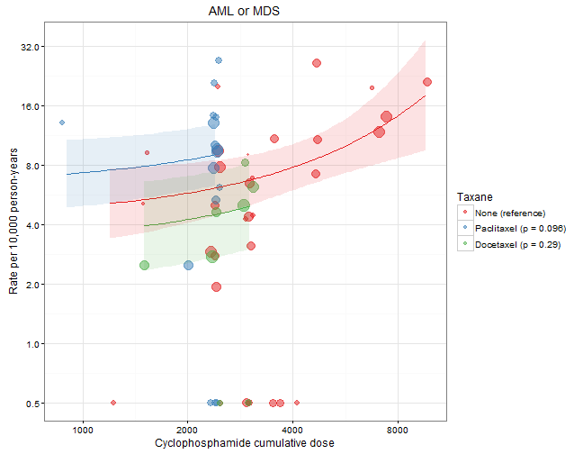

# Risks of Long-term Secondary Malignancies in Breast Cancer Patients Treated with Adjuvant Chemotherapy

* Author: [Benjamin Chan](http://careers.stackoverflow.com/benjaminchan)
* Date: 2016-08-01 15:38:56


# Load packages


```r
library(openxlsx)
library(data.table)
```

---

# Load data

Load the data from [GitHub](https://github.com/benjamin-chan/SecMalAfterBreastCaACT).


```r
repo <- "https://github.com/benjamin-chan/SecMalAfterBreastCaACT"
url <- paste0(repo, "/raw/26115dab1eb2b075d40f545514a03c3b30cde6b4/SecondaryMalignancies_Data_BG_3_4.xlsx")
f <- tempfile()
download.file(url, f, mode="wb")
file.info(f)[c("size", "mtime")]
```

```
##                                    size               mtime
## /tmp/RtmpSjUgrx/file2e9135ad62b41 59619 2016-08-01 15:38:57
```

```r
sheets <- getSheetNames(f)
# sheets
D <- read.xlsx(f, sheet = sheets[1], startRow = 3, colNames = FALSE)
D <- data.table(D)
oldnames <- names(D)
newnames <- c("id",
              "authorYear",
              "trial",
              "quality",
              "arm",
              "nRandomized",
              "nITT",
              # "pctCompletingTx",
              "medianFU",
              "regimen",
              "anthracyclineType",
              "anthracyclineTotalDose",
              "anthracyclineDuration",
              "anthracyclineCourses",
              "cyclophosphamideDose",
              "cyclophosphamideDuration",
              "cyclophosphamideCourses",
              "taxaneType",
              "taxaneTotalDose",
              "taxaneDuration",
              "taxaneCourses",
              "fluoroucilTotalDose",
              "fluoroucilDuration",
              "fluoroucilCourses",
              "otherTxDetails",
              "malAML",
              "malMDS",
              "malAMLOrMDS",
              "malNonBreastSolid",
              "malNonBreastSolidType",
              "malOtherBloodCancers",
              "malSMRelatedDeaths",
              "malSecondPrimary",
              "NOTES")
setnames(D, oldnames, newnames[1:33])
```

# Tidy data

Create a `rowid` variable.
This will be handy later.


```r
D <- D[, rowid := .I]
```

Fix some minor data entry inconsistencies.


```r
D <- D[grep("Nitz", authorYear), authorYear := gsub("2014$", "2014)", authorYear)]
D <- D[grep("Wolmark", authorYear), authorYear := gsub(", 2001$", " (2001)", authorYear)]
```

Input missing data for Bergh (2000); row was split.


```r
col <- grep("^cyclophosphamide", names(D), invert = TRUE)
D[11, col] <- D[10, col, with = FALSE]
# D[11, ]
# D[10, ]
```

Fix trial column for Romond (2005).


```r
D <- D[grep("Romond", authorYear), trial := gsub("&N", "& N", trial)]
```

Make `medianFU` numeric.


```r
D <- D[grep("-", medianFU, invert = TRUE), medianFUNum := round(as.numeric(medianFU), digits = 2)]
x <- D[grep("-", medianFU), medianFU]
x <- as.numeric(unlist(strsplit(x, "-")))
x1 <- x[seq(1, length(x), 2)]
x2 <- x[seq(2, length(x), 2)]
xbar <- rowMeans(cbind(x1, x2))
D <- D[grep("-", medianFU), medianFUNum := xbar]
D <- D[,
       `:=` (medianFUChar = medianFU,
             medianFU = medianFUNum,
             medianFUNum = NULL)]
unique(D[as.character(medianFU) != medianFUChar, .(medianFU, medianFUChar)])
```

```
##    medianFU       medianFUChar
## 1:     38.3 38.299999999999997
## 2:     73.0              71-75
## 3:     99.6 99.600000000000009
## 4:     28.8 28.799999999999997
```

```r
D <- D[, medianFUChar := NULL]
```

Recode mal* values of `NR` and `-` to `NA`.


```r
recode <- function(x) {
    missval <- c("-", "NR", " ")
    vec <- D[, get(x)]
    vec[vec %in% missval] <- NA
    vec
}
col <- grep("^mal", names(D), value = TRUE)
for (i in 1:length(col)) {
    D[, col[i]] <- recode(col[i])
}
```

Substitute non-numeric text in mal* values.


```r
substitute <- function(x) {
    vec <- D[, get(x)]
    vec <- gsub("[[:alpha:]]", "", vec)
    vec
}
col <- grep("^mal", names(D), value = TRUE)
for (i in 1:4) {
    # Only substitute a subset of mal* columns
    D[, col[i]] <- substitute(col[i])
}
```

Convert mal* values to numeric.


```r
for (i in 1:4) {
    # Only convert a subset of mal* columns
    D <- D[, col[i] := as.numeric(get(col[i]))]
}
```

The `malAMLOrMDS` column, as entered, captures number of AML or MDS malignancies if the study reported them grouped as opposed to separately.
If the study reported them as separately, then these counts are captures in the `malAML` and `malMDS` columns.
I.e., the `malAML`, `malMDS`, and `malAMLOrMDS` columns are mutually exclusive counts.
We want to create another column, `malAMLOrMDSTotal`, to be non-mutually exclusive from `malAML`, `malMDS`, and `malAMLOrMDS`.
If none of the `malAML`, `malMDS`, and `malAMLOrMDS` values are populated, then set `malAMLOrMDSTotal` to `NA`, also.
NOTE: Couldn't get this to work: [http://stackoverflow.com/a/16513949/1427069](http://stackoverflow.com/a/16513949/1427069).


```r
s <- sample(D[, rowid], 12)
malAMLOrMDSTotal <- rowSums(D[, .(malAML, malMDS, malAMLOrMDS)], na.rm=TRUE)
D <- D[, malAMLOrMDSTotal := malAMLOrMDSTotal]
D <- D[is.na(malAML) & is.na(malMDS) & is.na(malAMLOrMDS), malAMLOrMDSTotal := NA]
D[s, .(rowid, malAML, malMDS, malAMLOrMDS, malAMLOrMDSTotal)]
```

```
##     rowid malAML malMDS malAMLOrMDS malAMLOrMDSTotal
##  1:    49     NA     NA          NA               NA
##  2:    14      3      0          NA                3
##  3:    13      0      0          NA                0
##  4:    33      0      0          NA                0
##  5:    80     NA     NA          NA               NA
##  6:    41      1     NA          NA                1
##  7:    72      2     NA          NA                2
##  8:    78     NA     NA          NA               NA
##  9:    70     NA     NA          NA               NA
## 10:    28     NA     NA          NA               NA
## 11:    96     NA     NA          NA               NA
## 12:    71      1     NA          NA                1
```

Remove text from `nITT` column.


```r
D <- D[authorYear == "Misset (1996)" & arm == 2, nITT := "137"]
D <- D[authorYear == "Fumoleu (2003)" & arm == 1, nITT := "210"]
D <- D[authorYear == "Fumoleu (2003)" & arm == 2, nITT := "197"]
D <- D[authorYear == "Fumoleu (2003)" & arm == 3, nITT := "195"]
D <- D[, nITT := as.integer(nITT)]
```

Clean up the `regimen` and `dose` columns.
Output to [regimens.md](regimens.md) for checking.


```r
D <- D[, regimen := gsub("\\s$", "", regimen)]
D <- D[, regimen := gsub("\\r*\\n", " ", regimen)]
doseVar <- grep("dose", names(D), ignore.case = TRUE, value = TRUE)
for (i in 1:length(doseVar)) {
    D <- D[, doseVar[i] := gsub("\\r*\\n", " ", get(doseVar[i]))]
}
cat(kable(D[, .N, c("regimen", doseVar), with = TRUE][order(regimen)]),
    file = "regimens.md",
    sep = "\n")
file.info("regimens.md")
```

```
##             size isdir mode               mtime               ctime
## regimens.md 7215 FALSE  644 2016-08-01 15:38:58 2016-08-01 15:38:58
##                           atime  uid  gid uname   grname
## regimens.md 2016-08-01 15:33:32 4051 3010 chanb HPCUsers
```

Calculate cumulative dose: $\text{total dose} \times \text{number of courses}$.


```r
D <- D[, anthracyclineTotalDose := as.numeric(anthracyclineTotalDose)]
```

```
## Warning: NAs introduced by coercion
```

```r
D <- D[authorYear == "Bergh (2000)" & regimen == "FEC\nTailored", anthracyclineTotalDose := 75]
D <- D[authorYear == "Henderson (2003)", anthracyclineTotalDose := 75]
D <- D[authorYear == "Colleoni (2009)" & regimen == "AC-CMF", anthracyclineTotalDose := 75]
D <- D[, cyclophosphamideDose := as.numeric(cyclophosphamideDose)]
```

```
## Warning: NAs introduced by coercion
```

```r
D <- D[authorYear == "Colleoni (2009)" & regimen == "EC", cyclophosphamideDose := 600]
D <- D[authorYear == "Bergh (2000)" & regimen == "FEC\nTailored", cyclophosphamideDose := 900]
D <- D[authorYear == "Henderson (2003)", anthracyclineTotalDose := 75]
D <- D[, taxaneCourses := as.numeric(taxaneCourses)]
```

```
## Warning: NAs introduced by coercion
```

```r
D <- D[authorYear == "Shulman (2014)" & regimen == "T" & arm == 3, taxaneCourses := 4]
D <- D[authorYear == "Shulman (2014)" & regimen == "T" & arm == 4, taxaneCourses := 6]
D <- D[, fluoroucilTotalDose := as.numeric(fluoroucilTotalDose)]
```

```
## Warning: NAs introduced by coercion
```

```r
D <- D[authorYear == "Bergh (2000)" & regimen == "FEC\nTailored", fluoroucilTotalDose := 600]
D <- D[authorYear == "Joensuu (2012)" & regimen == "TX-CEX", fluoroucilTotalDose := NA]
D <- D[!is.na(anthracyclineTotalDose) & !is.na(anthracyclineTotalDose),
       anthracyclineCumulDose := anthracyclineTotalDose * anthracyclineCourses]
D <- D[!is.na(cyclophosphamideDose) & !is.na(cyclophosphamideCourses),
       cyclophosphamideCumulDose := cyclophosphamideDose * cyclophosphamideCourses]
D <- D[!is.na(as.numeric(taxaneTotalDose)) & !is.na(taxaneCourses),
       taxaneCumulDose := as.numeric(taxaneTotalDose) * taxaneCourses]
D <- D[!is.na(fluoroucilTotalDose) & !is.na(fluoroucilCourses),
       fluoroucilCumulDose := fluoroucilTotalDose * fluoroucilCourses]
# D <- D[is.na(anthracyclineCumulDose), anthracyclineCumulDose := 0]
# D <- D[is.na(cyclophosphamideCumulDose), cyclophosphamideCumulDose := 0]
# D <- D[is.na(taxaneCumulDose), taxaneCumulDose := 0]
# D <- D[is.na(fluoroucilCumulDose), fluoroucilCumulDose := 0]
```

Check.


```r
head(D[!is.na(anthracyclineCumulDose),
       .(authorYear, regimen, anthracyclineCumulDose, anthracyclineTotalDose, anthracyclineCourses)])
```

```
##       authorYear regimen anthracyclineCumulDose anthracyclineTotalDose
## 1: Fisher (1990)      AC                    240                     60
## 2: Fisher (1990)  AC-CMF                    240                     60
## 3: Misset (1996)    AVCF                    360                     30
## 4: Fisher (1999)      AC                    240                     60
## 5: Fisher (1999)      AC                    240                     60
## 6: Fisher (1999)      AC                    240                     60
##    anthracyclineCourses
## 1:                    4
## 2:                    4
## 3:                   12
## 4:                    4
## 5:                    4
## 6:                    4
```

```r
head(D[!is.na(cyclophosphamideCumulDose),
       .(authorYear, regimen, cyclophosphamideCumulDose, cyclophosphamideDose, cyclophosphamideCourses)])
```

```
##       authorYear regimen cyclophosphamideCumulDose cyclophosphamideDose
## 1: Fisher (1990)      AC                      2400                  600
## 2: Fisher (1990)  AC-CMF                      2400                  600
## 3: Misset (1996)    AVCF                     14400                 1200
## 4: Fisher (1999)      AC                      4800                 1200
## 5: Fisher (1999)      AC                      4800                 2400
## 6: Fisher (1999)      AC                      9600                 2400
##    cyclophosphamideCourses
## 1:                       4
## 2:                       4
## 3:                      12
## 4:                       4
## 5:                       2
## 6:                       4
```

```r
head(D[!is.na(taxaneCumulDose),
       .(authorYear, regimen, taxaneCumulDose, taxaneTotalDose, taxaneCourses)])
```

```
##        authorYear regimen taxaneCumulDose taxaneTotalDose taxaneCourses
## 1:  Citron (2003)   A-T-C             700             175             4
## 2:  Citron (2003)   A-T-C             700             175             4
## 3:  Citron (2003)    AC-T             700             175             4
## 4:  Citron (2003)    AC-T             700             175             4
## 5: Francis (2008) A-T-CMF             300             100             3
## 6: Francis (2008)  AT-CMF             300              75             4
```

```r
head(D[!is.na(fluoroucilCumulDose),
       .(authorYear, regimen, fluoroucilCumulDose, fluoroucilTotalDose, fluoroucilCourses)])
```

```
##          authorYear regimen fluoroucilCumulDose fluoroucilTotalDose
## 1:    Misset (1996)    AVCF               19200                1600
## 2: Venturini (2005)     FEC                3600                 600
## 3: Venturini (2005)     FEC                3600                 600
## 4:    Martin (2010)     FAC                3000                 500
## 5:     Roche (2006)     FEC                3000                 500
## 6:     Roche (2006)   FEC-T                1500                 500
##    fluoroucilCourses
## 1:                12
## 2:                 6
## 3:                 6
## 4:                 6
## 5:                 6
## 6:                 3
```

## Manual tidying

After an early round of analysis, we realized there were some `nITT` data entry errors in the commit [26115da](https://github.com/benjamin-chan/SecMalAfterBreastCaACT/raw/26115dab1eb2b075d40f545514a03c3b30cde6b4/SecondaryMalignancies_Data_BG_3_4.xlsx) (Jun 1, 2016) spreadsheet.


```r
D <- D[authorYear == "Mamounas (2005)" & nITT == 1528, `:=` (nITTOld = nITT, nITT = 1529, isFixed = TRUE)]
D <- D[authorYear == "Fumoleu (2003)" & nITT == 210, `:=` (nITTOld = nITT, nITT = 212, isFixed = TRUE)]
D <- D[authorYear == "Fumoleu (2003)" & nITT == 197, `:=` (nITTOld = nITT, nITT = 209, isFixed = TRUE)]
D <- D[authorYear == "Fumoleu (2003)" & nITT == 195, `:=` (nITTOld = nITT, nITT = 200, isFixed = TRUE)]
D <- D[authorYear == "Fargeot (2004)" & nITT == 155, `:=` (nITTOld = nITT, nITT = 164, isFixed = TRUE)]
D <- D[authorYear == "Fargeot (2004)" & nITT == 163, `:=` (nITTOld = nITT, nITT = 174, isFixed = TRUE)]
D <- D[authorYear == "Kerbrat (2007)" & nITT == 235, `:=` (nITTOld = nITT, nITT = 241, isFixed = TRUE)]
D <- D[authorYear == "Kerbrat (2007)" & nITT == 236, `:=` (nITTOld = nITT, nITT = 241, isFixed = TRUE)]
D <- D[authorYear == "Fisher (1997)" & nITT == 763, `:=` (nITTOld = nITT, nITT = 767, isFixed = TRUE)]
D <- D[authorYear == "Fisher (1997)" & nITT == 771, `:=` (nITTOld = nITT, nITT = 772, isFixed = TRUE)]
D <- D[authorYear == "Bonneterre (2005)" & nITT == 271, `:=` (nITTOld = nITT, nITT = 289, isFixed = TRUE)]
D <- D[authorYear == "Bonneterre (2005)" & nITT == 266, `:=` (nITTOld = nITT, nITT = 276, isFixed = TRUE)]
D <- D[authorYear == "Roche (2006)" & nITT == 163, `:=` (nITTOld = nITT, nITT = 164, isFixed = TRUE)]
D <- D[authorYear == "Roche (2006)" & nITT == 168, `:=` (nITTOld = nITT, nITT = 169, isFixed = TRUE)]
D <- D[authorYear == "Shulman (2014)" & nITT == 1107, `:=` (nITTOld = nITT, nITT = 1142, isFixed = TRUE)]
D <- D[authorYear == "Shulman (2014)" & nITT ==  766, `:=` (nITTOld = nITT, nITT =  789, isFixed = TRUE)]
D <- D[authorYear == "Shulman (2014)" & nITT == 1119, `:=` (nITTOld = nITT, nITT = 1151, isFixed = TRUE)]
D <- D[authorYear == "Shulman (2014)" & nITT ==  782, `:=` (nITTOld = nITT, nITT =  789, isFixed = TRUE)]
D <- D[authorYear == "Swain (2013)" & nITT == 1617, `:=` (nITTOld = nITT, nITT = 1630, isFixed = TRUE)]
D <- D[authorYear == "Swain (2013)" & nITT == 1624, `:=` (nITTOld = nITT, nITT = 1634, isFixed = TRUE)]
D <- D[authorYear == "Swain (2013)" & nITT == 1618, `:=` (nITTOld = nITT, nITT = 1630, isFixed = TRUE)]
D[isFixed == TRUE, .(authorYear, regimen, nITTOld, nITT)]
```

```
##            authorYear   regimen nITTOld nITT
##  1:   Mamounas (2005)        AC    1528 1529
##  2:    Fumoleu (2003)    FEC 50     210  212
##  3:    Fumoleu (2003)  3 FEC 50     197  209
##  4:    Fumoleu (2003)    FEC 75     195  200
##  5:    Fargeot (2004) Tamoxifen     155  164
##  6:    Fargeot (2004)   EPI-Tam     163  174
##  7:    Kerbrat (2007)       FEC     235  241
##  8:    Kerbrat (2007)     E+Vnr     236  241
##  9:     Fisher (1997)        AC     763  767
## 10:     Fisher (1997)        AC     771  772
## 11: Bonneterre (2005)    FEC 50     271  289
## 12: Bonneterre (2005)   FEC 100     266  276
## 13:      Roche (2006) Tamoxifen     163  164
## 14:      Roche (2006)       FEC     168  169
## 15:    Shulman (2014)        AC    1107 1142
## 16:    Shulman (2014)        AC     766  789
## 17:    Shulman (2014)         T    1119 1151
## 18:    Shulman (2014)         T     782  789
## 19:      Swain (2013)       ACT    1617 1630
## 20:      Swain (2013)      AC-T    1624 1634
## 21:      Swain (2013)     AC-TG    1618 1630
##            authorYear   regimen nITTOld nITT
```

```r
D <- D[, `:=` (nITTOld = NULL, isFixed = NULL)]
```

We also made the decision to use the AML/MDS outcomes reported in Perez (2011) as the outcomes for Romond (2005) since they study the same cohort. Other edits to *AML or MDS* and *non-breast solid* malignancy outcome were needed, as well.


```r
D <- D[authorYear == "Martin (2010)" & regimen == "TAC",
      `:=` (malAMLOrMDSTotalOld = malAMLOrMDSTotal, malAMLOrMDSTotal = 0, isFixed = TRUE)]
D <- D[authorYear == "Martin (2010)" & regimen == "FAC",
      `:=` (malAMLOrMDSTotalOld = malAMLOrMDSTotal, malAMLOrMDSTotal = 0, isFixed = TRUE)]
D <- D[authorYear == "Romond (2005)" & regimen == "AC-T",
      `:=` (malAMLOrMDSTotalOld = malAMLOrMDSTotal, malAMLOrMDSTotal = 2, isFixed = TRUE)]
D <- D[authorYear == "Romond (2005)" & regimen == "ACT-T-Trast",
      `:=` (malAMLOrMDSTotalOld = malAMLOrMDSTotal, malAMLOrMDSTotal = 1, isFixed = TRUE)]
D <- D[authorYear == "Del Mastro (2015)",
      `:=` (malAMLOrMDSTotalOld = malAMLOrMDSTotal, malAMLOrMDSTotal = 0, isFixed = TRUE)]
D <- D[authorYear == "Del Mastro (2015)" & regimen == "EC-T" & nITT == 502,
      `:=` (malAMLOrMDSTotalOld = malAMLOrMDSTotal, malAMLOrMDSTotal = 2, isFixed = TRUE)]

D <- D[authorYear == "Bernard-Marty (2003)" & regimen == "EC" & nITT == 267,
      `:=` (malNonBreastSolidOld = malNonBreastSolid, malNonBreastSolid = 4, isFixed = TRUE)]
D <- D[authorYear == "Bonneterre (2005)" & regimen == "FEC 50",
      `:=` (malNonBreastSolidOld = malNonBreastSolid, malNonBreastSolid = 11, isFixed = TRUE)]
D <- D[authorYear == "Bonneterre (2005)" & regimen == "FEC 100",
      `:=` (malNonBreastSolidOld = malNonBreastSolid, malNonBreastSolid = 15, isFixed = TRUE)]
D <- D[authorYear == "Citron (2003)" & regimen == "A-T-C" & nITT == 493,
      `:=` (malNonBreastSolidOld = malNonBreastSolid, malNonBreastSolid = 11, isFixed = TRUE)]
D <- D[authorYear == "Citron (2003)" & regimen == "AC-T" & nITT == 495,
      `:=` (malNonBreastSolidOld = malNonBreastSolid, malNonBreastSolid = 11, isFixed = TRUE)]
D <- D[authorYear == "Eiermann (2011)" & regimen == "AC-T",
      `:=` (malNonBreastSolidOld = malNonBreastSolid, malNonBreastSolid = 34, isFixed = TRUE)]
D <- D[authorYear == "Eiermann (2011)" & regimen == "TAC",
      `:=` (malNonBreastSolidOld = malNonBreastSolid, malNonBreastSolid = 31, isFixed = TRUE)]
D <- D[authorYear == "Romond (2005)" & regimen == "AC-T",
      `:=` (malNonBreastSolidOld = malNonBreastSolid, malNonBreastSolid = 13, isFixed = TRUE)]
D <- D[authorYear == "Romond (2005)" & regimen == "ACT-T-Trast",
      `:=` (malNonBreastSolidOld = malNonBreastSolid, malNonBreastSolid = 4, isFixed = TRUE)]

D[isFixed == TRUE,
  .(authorYear, regimen, nITT, malAMLOrMDSTotalOld, malAMLOrMDSTotal, malNonBreastSolidOld, malNonBreastSolid)]
```

```
##               authorYear     regimen nITT malAMLOrMDSTotalOld
##  1: Bernard-Marty (2003)          EC  267                  NA
##  2:        Citron (2003)       A-T-C  493                  NA
##  3:        Citron (2003)        AC-T  495                  NA
##  4:        Martin (2010)         TAC  539                  NA
##  5:        Martin (2010)         FAC  521                  NA
##  6:    Bonneterre (2005)      FEC 50  289                  NA
##  7:    Bonneterre (2005)     FEC 100  276                  NA
##  8:      Eiermann (2011)        AC-T 1649                  NA
##  9:      Eiermann (2011)         TAC 1649                  NA
## 10:        Romond (2005)        AC-T  872                  NA
## 11:        Romond (2005) ACT-T-Trast  864                  NA
## 12:    Del Mastro (2015)        EC-T  545                  NA
## 13:    Del Mastro (2015)       FEC-T  544                  NA
## 14:    Del Mastro (2015)        EC-T  502                   0
## 15:    Del Mastro (2015)       FEC-T  500                  NA
##     malAMLOrMDSTotal malNonBreastSolidOld malNonBreastSolid
##  1:                0                    3                 4
##  2:                3                   10                11
##  3:                2                   10                11
##  4:                0                   NA                 9
##  5:                0                   NA                16
##  6:                1                    9                11
##  7:                1                   12                15
##  8:                2                   NA                34
##  9:                4                   NA                31
## 10:                2                   NA                13
## 11:                1                   NA                 4
## 12:                0                   NA                NA
## 13:                0                   NA                NA
## 14:                2                   NA                NA
## 15:                0                   NA                NA
```

```r
D <- D[, `:=` (malAMLOrMDSTotalOld = NULL, malNonBreastSolidOld = NULL, isFixed = NULL)]
```

Deduplicate.


```r
n0 <- nrow(D)
setkey(D, authorYear, trial, arm)
D <- unique(D)
message(sprintf("Removed %d duplicate row(s) (%.03g%%)", n0 - nrow(D), (n0 - nrow(D)) / n0 * 100))
```

```
## Removed 1 duplicate row(s) (1.03%)
```

---

# Summarize

Define some functions.


```r
scale <- 1e4
calcPct <- function (x, n) {
  prec <- "%.3g"
  sprintf(paste0(prec, "%%"),
          median(x / n, na.rm = TRUE) * 100)
}
calcRate <- function (x, n, y) {
  prec <- "%.3g"
  py <- scale
  sprintf(paste(prec, "per %s p-y"),
          median(x / (n * (y / 12)), na.rm=TRUE) * py,
          py)
}
```

Summarize the regimens.
Output to [summaryRegimens.md](summaryRegimens.md) for checking.


```r
D <- D[,
       `:=` (isAnthra = !is.na(anthracyclineTotalDose),
             isCyclo = !is.na(cyclophosphamideDose),
             isTaxane = !is.na(taxaneTotalDose),
             isFluoro = !is.na(fluoroucilTotalDose))]
D1 <- melt(D,
           id.vars=c("id", "authorYear", "arm",
                     "isAnthra", "anthracyclineCumulDose",
                     "isCyclo", "cyclophosphamideCumulDose",
                     "isTaxane", "taxaneCumulDose",
                     "isFluoro", "fluoroucilCumulDose",
                     "nITT", "medianFU"),
           measure.vars=c("malAML", "malMDS", "malAMLOrMDSTotal", "malNonBreastSolid"),
           value.name="malN",
           variable.name="malType")

D1 <- D1[, malType := gsub("^mal", "", malType)]
D1 <- D1[, malType := factor(malType,
                             levels=c("AML", "MDS", "AMLOrMDSTotal", "NonBreastSolid"),
                             labels=c("AML", "MDS", "AML or MDS", "Non-Breast Solid"))]
D1 <- D1[, py := nITT * (medianFU / 12)]
D1 <- D1[, rate := malN / py * scale]
summaryRegimens <- D1[,
                      .(totalN = sum(nITT, na.rm = TRUE),
                        totalPersonYears = round(sum(py, na.rm = TRUE)),
                        totalMalignancies = sum(malN, na.rm = TRUE),
                        medianPct = calcPct(malN, nITT),
                        medianRate = calcRate(malN, nITT, medianFU)),
                      .(isAnthra,
                        isCyclo,
                        isTaxane,
                        isFluoro,
                        malType)]
summaryRegimens <- summaryRegimens[order(-isAnthra, -isCyclo, -isTaxane, -isFluoro, malType)]
cat(kable(summaryRegimens),
    file = "summaryRegimens.md",
    sep = "\n")
file.info("summaryRegimens.md")
```

```
##                    size isdir mode               mtime               ctime
## summaryRegimens.md 4624 FALSE  644 2016-08-01 15:38:58 2016-08-01 15:38:58
##                                  atime  uid  gid uname   grname
## summaryRegimens.md 2016-08-01 15:33:32 4051 3010 chanb HPCUsers
```

---

# Study Characteristics and Outcomes

Populate Appendix Table 1.
Need columns for

* Study
* Country
* Median follow-up (months)
* Regimen name
* Cumulative dose
    * Anthracyclines
    * Cyclophosphamide
    * Taxanes
* N
* Person-years (the denominator for the incidence rate)
* AML/MDS count (the numerator for the incidence rate)
* AML/MDS incidence, per 10,000 person-years
* Non-breast solid count (the numerator for the incidence rate)
* Non-breast solid incidence, per 10,000 person-years

Output to multiple formats:

* Excel workbook, [appendixTableStudyCharacteristicsAndOutcomes.xlsx](appendixTableStudyCharacteristicsAndOutcomes.xlsx)
* CSV file, [appendixTableStudyCharacteristicsAndOutcomes.csv](appendixTableStudyCharacteristicsAndOutcomes.csv)
* Markdown file, [appendixTableStudyCharacteristicsAndOutcomes.md](appendixTableStudyCharacteristicsAndOutcomes.md)


```r
library(xlsx)
```

```
## Error in library(xlsx): there is no package called 'xlsx'
```

```r
library(IRdisplay)
```

```
## Error in library(IRdisplay): there is no package called 'IRdisplay'
```

```r
library(xtable)
T <- D[,
       .(study = ifelse(!is.na(trial), paste(authorYear, trial), authorYear),
         country = NA,
         medianFU = round(medianFU),
         regimen,
         anthrCumulDose = round(anthracyclineCumulDose),
         cycloCumulaDose = round(cyclophosphamideCumulDose),
         taxaneCumulDose = round(taxaneCumulDose),
         nITT,
         py = nITT * (medianFU / 12),
         nAMLOrMDS = malAMLOrMDSTotal,
         incidenceAMLOrMDS = signif(malAMLOrMDSTotal / (nITT * (medianFU / 12)) * scale, digits=3),
         nNonBreastSolid = malNonBreastSolid,
         incidenceNonBreastSolid = signif(malNonBreastSolid / (nITT * (medianFU / 12)) * scale, digits=3))]
write.xlsx(T,
           "appendixTableStudyCharacteristicsAndOutcomes.xlsx",
           row.names=FALSE,
           showNA=FALSE)
write.csv(T,
          "appendixTableStudyCharacteristicsAndOutcomes.csv",
          quote=FALSE,
          row.names=FALSE)
cat(kable(T),
    file = "appendixTableStudyCharacteristicsAndOutcomes.md",
    sep = "\n")
file.info(grep("appendixTableStudyCharacteristicsAndOutcomes", list.files(), value=TRUE))[c("size", "mtime")]
```

```
##                                                    size
## appendixTableStudyCharacteristicsAndOutcomes.csv   7205
## appendixTableStudyCharacteristicsAndOutcomes.md   20580
## appendixTableStudyCharacteristicsAndOutcomes.xlsx 15884
##                                                                 mtime
## appendixTableStudyCharacteristicsAndOutcomes.csv  2016-08-01 15:38:58
## appendixTableStudyCharacteristicsAndOutcomes.md   2016-08-01 15:38:58
## appendixTableStudyCharacteristicsAndOutcomes.xlsx 2016-08-01 15:38:58
```

```r
T <- xtable(T, digits=c(rep(0, ncol(T) - 3), 0, 2, 0, 2))
```

---

# Meta-regression

Estimate meta-regression models for log transformed incidence rate.
Model is

$$\frac{y_i}{\text{py}_i} = \beta x_i + \sigma_\text{study}$$

Or

$$\frac{y_i}{\text{py}_i} = \beta I_{\text{high dose}, i} + \sigma_\text{study}$$

Models were estimated using the `rma.mv()` function from the metafor` package for R.


```r
library(metafor)
```

```
## Loading required package: Matrix
```

```
## Loading 'metafor' package (version 1.9-8). For an overview 
## and introduction to the package please type: help(metafor).
```

```r
citation("metafor")
```

```
## 
## To cite the metafor package in publications, please use:
## 
##   Viechtbauer, W. (2010). Conducting meta-analyses in R with the
##   metafor package. Journal of Statistical Software, 36(3), 1-48.
##   URL: http://www.jstatsoft.org/v36/i03/
## 
## A BibTeX entry for LaTeX users is
## 
##   @Article{,
##     title = {Conducting meta-analyses in {R} with the {metafor} package},
##     author = {Wolfgang Viechtbauer},
##     journal = {Journal of Statistical Software},
##     year = {2010},
##     volume = {36},
##     number = {3},
##     pages = {1--48},
##     url = {http://www.jstatsoft.org/v36/i03/},
##   }
```

Define meta-regression functions.


```r
pvalToChar <- function (p) {
  if (p < 0.001) {
    pvalue <- "p < 0.001"
  } else {
    pvalue <- sprintf("p = %.03f", p)
  }
  pvalue
}
metareg <- function (D) {
  require(metafor)
  D <- D[!(is.na(x) | is.na(rate) | is.na(nITT) | is.na(malType))]
  xData <- unique(D[, .(drug, x, xHighDose, malType)])
  D <- escalc("IRLN", xi=malN, ti=py, data=D)
  randomEffect <- list(~ 1 | id)
  MLin <- rma.mv(yi ~ x, vi, random=randomEffect, data=D)
  MBin <- rma.mv(yi ~ xHighDose, vi, random=randomEffect, data=D)
  pvalueLin <- MLin$pval[which(row.names(MLin$b) == "x")]
  pvalueBin <- MBin$pval[which(row.names(MBin$b) == "xHighDoseTRUE")]
  predLin <- predict(MLin, xData[, x], transf = exp)[["pred"]] * scale
  confLowerLin <- predict(MLin, xData[, x], transf = exp)[["cr.lb"]] * scale
  confUpperLin <- predict(MLin, xData[, x], transf = exp)[["cr.ub"]] * scale
  predBin <- predict(MBin, xData[, xHighDose], transf = exp)[["pred"]] * scale
  confLowerBin <- predict(MBin, xData[, xHighDose], transf = exp)[["cr.lb"]] * scale
  confUpperBin <- predict(MBin, xData[, xHighDose], transf = exp)[["cr.ub"]] * scale
  pred <- data.table(xData, predLin, confLowerLin, confUpperLin, predBin, confLowerBin, confUpperBin, scale)
  setorder(pred, x)
  list(rmaLin = MLin,
       rmaBin = MBin,
       pvalueLin = pvalToChar(pvalueLin),
       pvalueBin = pvalToChar(pvalueBin),
       pred = pred)
}
plotreg <- function (M, D, title, xlab, xbreaks, xscale) {
  require(ggplot2)
  require(RColorBrewer)
  require(tools)
  pvalues <- c(M$pvalueLin, M$pvalueBin)
  x <- seq(min(M$rmaLin$X[, "x"]), max(M$rmaLin$X[, "x"]), length.out=100)
  yhat1 <- unique(data.table(malType = mal,
                             x,
                             yhat = predict(M$rmaLin, x, transf = exp)[["pred"]] * scale))
  xHighDose <- as.logical(M$rmaBin$X[, "xHighDoseTRUE"])
  yhat2 <- unique(data.table(malType = mal,
                             xHighDose,
                             yhat = predict(M$rmaBin, xHighDose, transf = exp)[["pred"]] * scale))
  D <- D[!(is.na(x) | is.na(rate) | is.na(nITT) | is.na(malType))]
  D <- D[, malType := droplevels(malType)]
  steps <- merge(D[, .(min = min(x), max = max(x)), .(malType, xHighDose)],
                 yhat2,
                 by=c("malType", "xHighDose"))
  steps <- melt(steps, id.vars=c("malType", "xHighDose", "yhat"), measure.vars=c("min", "max"), value.name="x")
  annoLin <- data.frame(x=Inf, y=1.2, label=pvalues[c(1)], malType=levels(D[, malType]))
  annoBin <- data.frame(x=Inf, y=1.4, label=pvalues[c(2)], malType=levels(D[, malType]))
  pal <- brewer.pal(4, name="RdBu")
  G <- ggplot(D, aes(x=x * xscale, y=rate + 1/2, size=nITT / min(nITT, na.rm=TRUE)))
  G <- G + geom_point(alpha=1/3, position="jitter")
  G <- G + geom_line(data=yhat1, aes(x=x * xscale, y=yhat), inherit.aes=FALSE, color=pal[4])
  G <- G + geom_step(data=steps, aes(x=x * xscale, y=yhat), inherit.aes=FALSE, color=pal[1])
  G <- G + geom_text(data=annoLin,
                     aes(x, y, label=label), inherit.aes=FALSE, hjust=1, color=pal[4])
  G <- G + geom_text(data=annoBin,
                     aes(x, y, label=label), inherit.aes=FALSE, hjust=1, color=pal[1])
  G <- G + scale_x_log10(xlab, breaks=xbreaks)
  G <- G + scale_y_log10(sprintf("Rate per %s person-years", format(scale, big.mark=",")))
  G <- G + labs(title=title)
  G <- G + theme_bw()
  G <- G + theme(legend.position="none")
  filename <- gsub("\\s+",
                   "",
                   toTitleCase(paste(gsub("[[:punct:]]", "", title),
                                     gsub("cumulative dose", "", xlab),
                                     sep="_")))
  ggsave(filename=sprintf("%s.png", filename))
  write.csv(D, file=sprintf("%s.csv", filename), row.names=FALSE, quote=FALSE)
  M$pred[, x := x * xscale]
  write.csv(M$pred, file=sprintf("%s_Pred.csv", filename), row.names=FALSE, quote=FALSE)
  show(file.info(c(sprintf("%s.png", filename), sprintf("%s.csv", filename)))[c("size", "mtime")])
  G
}
```

Dichotomize cumulative doses

* Cyclophosphamide
    * $\lt 2400$
    * $\ge 2400$
* Taxane
    * $\lt 500$
    * $\ge 500$


```r
D2 <- D1[,
         .(id = factor(id),
           authorYear,
           isCyclo,
           xCyc = cyclophosphamideCumulDose / 1e3,
           xCycHighDose = cyclophosphamideCumulDose >= 2400,
           xTax = taxaneCumulDose / 1e2,
           xTaxHighDose = taxaneCumulDose >= 500,
           isAnthra,
           isTaxane,
           isFluoro,
           nITT,
           medianFU,
           malType,
           malN,
           py,
           rate)]
```

## AML/MDS

* Fit the models
* Show model summaries
* Plot the predicted values


```r
mal <- "AML or MDS"
D3 <- D2[malType == mal]
```


```r
D3 <- D3[, `:=` (drug = "Cyclophosphamide", x = xCyc, xHighDose = xCycHighDose)]
M <- metareg(D3)
M
```

```
## $rmaLin
## 
## Multivariate Meta-Analysis Model (k = 56; method: REML)
## 
## Variance Components: 
## 
##             estim    sqrt  nlvls  fixed  factor
## sigma^2    0.1693  0.4115     26     no      id
## 
## Test for Residual Heterogeneity: 
## QE(df = 54) = 67.8113, p-val = 0.0980
## 
## Test of Moderators (coefficient(s) 2): 
## QM(df = 1) = 4.4383, p-val = 0.0351
## 
## Model Results:
## 
##          estimate      se      zval    pval    ci.lb    ci.ub     
## intrcpt   -7.6135  0.2258  -33.7187  <.0001  -8.0560  -7.1709  ***
## x          0.1182  0.0561    2.1067  0.0351   0.0082   0.2281    *
## 
## ---
## Signif. codes:  0 '***' 0.001 '**' 0.01 '*' 0.05 '.' 0.1 ' ' 1 
## 
## 
## $rmaBin
## 
## Multivariate Meta-Analysis Model (k = 56; method: REML)
## 
## Variance Components: 
## 
##             estim    sqrt  nlvls  fixed  factor
## sigma^2    0.2447  0.4946     26     no      id
## 
## Test for Residual Heterogeneity: 
## QE(df = 54) = 81.5431, p-val = 0.0091
## 
## Test of Moderators (coefficient(s) 2): 
## QM(df = 1) = 0.4988, p-val = 0.4800
## 
## Model Results:
## 
##                estimate      se      zval    pval    ci.lb    ci.ub     
## intrcpt         -7.5326  0.4261  -17.6799  <.0001  -8.3676  -6.6975  ***
## xHighDoseTRUE    0.3084  0.4367    0.7062  0.4800  -0.5475   1.1642     
## 
## ---
## Signif. codes:  0 '***' 0.001 '**' 0.01 '*' 0.05 '.' 0.1 ' ' 1 
## 
## 
## $pvalueLin
## [1] "p = 0.035"
## 
## $pvalueBin
## [1] "p = 0.480"
## 
## $pred
##                 drug    x xHighDose    malType   predLin confLowerLin
##  1: Cyclophosphamide 0.90     FALSE AML or MDS  5.491553     2.267006
##  2: Cyclophosphamide 1.20     FALSE AML or MDS  5.689755     2.371329
##  3: Cyclophosphamide 1.50     FALSE AML or MDS  5.895109     2.477600
##  4: Cyclophosphamide 2.00     FALSE AML or MDS  6.253970     2.658358
##  5: Cyclophosphamide 2.40      TRUE AML or MDS  6.556724     2.805509
##  6: Cyclophosphamide 3.00      TRUE AML or MDS  7.038556     3.028854
##  7: Cyclophosphamide 3.60      TRUE AML or MDS  7.555796     3.253208
##  8: Cyclophosphamide 4.00      TRUE AML or MDS  7.921572     3.402173
##  9: Cyclophosphamide 4.80      TRUE AML or MDS  8.707101     3.695747
## 10: Cyclophosphamide 6.64      TRUE AML or MDS 10.822230     4.329759
## 11: Cyclophosphamide 7.20      TRUE AML or MDS 11.562728     4.507659
## 12: Cyclophosphamide 9.60      TRUE AML or MDS 15.354901     5.182626
##     confUpperLin  predBin confLowerBin confUpperBin scale
##  1:     13.30264 5.353449     1.489197     19.24488 10000
##  2:     13.65197 5.353449     1.489197     19.24488 10000
##  3:     14.02661 5.353449     1.489197     19.24488 10000
##  4:     14.71289 5.353449     1.489197     19.24488 10000
##  5:     15.32365 7.287257     2.658349     19.97636 10000
##  6:     16.35644 7.287257     2.658349     19.97636 10000
##  7:     17.54885 7.287257     2.658349     19.97636 10000
##  8:     18.44448 7.287257     2.658349     19.97636 10000
##  9:     20.51374 7.287257     2.658349     19.97636 10000
## 10:     27.05016 7.287257     2.658349     19.97636 10000
## 11:     29.65989 7.287257     2.658349     19.97636 10000
## 12:     45.49296 7.287257     2.658349     19.97636 10000
```

```r
plotreg(M,
        D3,
        mal,
        "Cyclophosphamide cumulative dose",
        1e3 * c(0.5, 1, 2, 4, 8, 16),
        1e3)
```

```
## Loading required package: ggplot2
```

```
## Loading required package: RColorBrewer
```

```
## Loading required package: tools
```

```
## Saving 7 x 7 in image
```

```
##                                 size               mtime
## AMLorMDS_Cyclophosphamide.png 159601 2016-08-01 15:39:00
## AMLorMDS_Cyclophosphamide.csv   7240 2016-08-01 15:39:00
```


```r
D3 <- D3[, `:=` (drug = "Taxane", x = xTax, xHighDose = xTaxHighDose)]
M <- metareg(D3)
M
```

```
## $rmaLin
## 
## Multivariate Meta-Analysis Model (k = 27; method: REML)
## 
## Variance Components: 
## 
##             estim    sqrt  nlvls  fixed  factor
## sigma^2    0.2494  0.4994     16     no      id
## 
## Test for Residual Heterogeneity: 
## QE(df = 25) = 30.4549, p-val = 0.2077
## 
## Test of Moderators (coefficient(s) 2): 
## QM(df = 1) = 2.5512, p-val = 0.1102
## 
## Model Results:
## 
##          estimate      se      zval    pval    ci.lb    ci.ub     
## intrcpt   -8.2329  0.5566  -14.7925  <.0001  -9.3238  -7.1421  ***
## x          0.1455  0.0911    1.5972  0.1102  -0.0331   0.3241     
## 
## ---
## Signif. codes:  0 '***' 0.001 '**' 0.01 '*' 0.05 '.' 0.1 ' ' 1 
## 
## 
## $rmaBin
## 
## Multivariate Meta-Analysis Model (k = 27; method: REML)
## 
## Variance Components: 
## 
##             estim    sqrt  nlvls  fixed  factor
## sigma^2    0.1712  0.4137     16     no      id
## 
## Test for Residual Heterogeneity: 
## QE(df = 25) = 26.2243, p-val = 0.3957
## 
## Test of Moderators (coefficient(s) 2): 
## QM(df = 1) = 4.7966, p-val = 0.0285
## 
## Model Results:
## 
##                estimate      se      zval    pval    ci.lb    ci.ub     
## intrcpt         -7.7251  0.2433  -31.7527  <.0001  -8.2019  -7.2482  ***
## xHighDoseTRUE    0.6598  0.3013    2.1901  0.0285   0.0693   1.2503    *
## 
## ---
## Signif. codes:  0 '***' 0.001 '**' 0.01 '*' 0.05 '.' 0.1 ' ' 1 
## 
## 
## $pvalueLin
## [1] "p = 0.110"
## 
## $pvalueBin
## [1] "p = 0.029"
## 
## $pred
##       drug   x xHighDose    malType  predLin confLowerLin confUpperLin
##  1: Taxane 2.4     FALSE AML or MDS 3.768667     1.127516     12.59658
##  2: Taxane 3.0     FALSE AML or MDS 4.112574     1.292010     13.09066
##  3: Taxane 3.2     FALSE AML or MDS 4.234047     1.349621     13.28311
##  4: Taxane 4.0     FALSE AML or MDS 4.756896     1.591300     14.21986
##  5: Taxane 4.5     FALSE AML or MDS 5.115978     1.748778     14.96658
##  6: Taxane 4.8     FALSE AML or MDS 5.344310     1.844382     15.48576
##  7: Taxane 6.0      TRUE AML or MDS 6.364197     2.221764     18.23011
##  8: Taxane 7.0      TRUE AML or MDS 7.361284     2.510308     21.58639
##  9: Taxane 7.5      TRUE AML or MDS 7.916961     2.639796     23.74361
## 10: Taxane 8.0      TRUE AML or MDS 8.514585     2.757579     26.29051
## 11: Taxane 9.0      TRUE AML or MDS 9.848576     2.955772     32.81526
##      predBin confLowerBin confUpperBin scale
##  1: 4.416177     1.723889     11.31316 10000
##  2: 4.416177     1.723889     11.31316 10000
##  3: 4.416177     1.723889     11.31316 10000
##  4: 4.416177     1.723889     11.31316 10000
##  5: 4.416177     1.723889     11.31316 10000
##  6: 4.416177     1.723889     11.31316 10000
##  7: 8.542865     3.399838     21.46588 10000
##  8: 8.542865     3.399838     21.46588 10000
##  9: 8.542865     3.399838     21.46588 10000
## 10: 8.542865     3.399838     21.46588 10000
## 11: 8.542865     3.399838     21.46588 10000
```

```r
plotreg(M,
        D3,
        mal,
        "Taxane cumulative dose",
        1e2 * c(0.5, 1, 2, 4, 8, 16),
        1e2)
```

```
## Saving 7 x 7 in image
```

```
##                       size               mtime
## AMLorMDS_Taxane.png 119578 2016-08-01 15:39:01
## AMLorMDS_Taxane.csv   3262 2016-08-01 15:39:01
```



### Cyclophosphamide, with and without Taxanes

The effect of cyclophosphamide could be due to taxanes in the regimen.

Fit the meta-regression model

$$\frac{y_i}{\text{py}_i} = \beta_0 + \beta_1 x_{\text{cyclophosphamide dose}, i} + \beta_2 I_{\text{taxane}, i} + \beta_3 x_{\text{cyclophosphamide dose}, i} I_{\text{taxane}, i} + \sigma_\text{study}$$

where $I_{\text{taxane}, i}$ is an 0/1 indicator for whether study $i$ has taxane in the regimen.
The interpretation of $\beta_1$ is the effect of cyclophosphamide dose among the studies with no taxane in the regimen.


```r
mal <- "AML or MDS"
D3 <- D2[malType == mal]
D3 <- D3[, drug := "Cyclophosphamide"]
D3 <- D3[isCyclo == FALSE, xCycHighDose := FALSE]
D3 <- D3[!(is.na(xCyc) | is.na(xCycHighDose) | is.na(rate) | is.na(nITT) | is.na(malType))]
xData <- unique(D3[, .(drug, xCyc, xCycHighDose, isTaxane, malType)])
D3 <- escalc("IRLN", xi=malN, ti=py, data=D3)
randomEffect <- list(~ 1 | id)
MLin <- rma.mv(yi ~ xCyc + isTaxane + xCyc * isTaxane,
               vi,
               random=randomEffect,
               data=D3)
MBin <- rma.mv(yi ~ xCycHighDose + isTaxane + xCycHighDose * isTaxane,
               vi,
               random=randomEffect,
               data=D3)
M <- list(rmaLin = MLin,
          rmaBin = MBin)
M
```

```
## $rmaLin
## 
## Multivariate Meta-Analysis Model (k = 56; method: REML)
## 
## Variance Components: 
## 
##             estim    sqrt  nlvls  fixed  factor
## sigma^2    0.1591  0.3988     26     no      id
## 
## Test for Residual Heterogeneity: 
## QE(df = 52) = 64.6531, p-val = 0.1119
## 
## Test of Moderators (coefficient(s) 2,3,4): 
## QM(df = 3) = 5.4087, p-val = 0.1442
## 
## Model Results:
## 
##                    estimate      se      zval    pval    ci.lb    ci.ub
## intrcpt             -7.7389  0.2767  -27.9695  <.0001  -8.2812  -7.1966
## xCyc                 0.1374  0.0594    2.3141  0.0207   0.0210   0.2537
## isTaxaneTRUE         0.6291  0.8762    0.7180  0.4728  -1.0883   2.3465
## xCyc:isTaxaneTRUE   -0.1950  0.3478   -0.5607  0.5750  -0.8767   0.4867
##                       
## intrcpt            ***
## xCyc                 *
## isTaxaneTRUE          
## xCyc:isTaxaneTRUE     
## 
## ---
## Signif. codes:  0 '***' 0.001 '**' 0.01 '*' 0.05 '.' 0.1 ' ' 1 
## 
## 
## $rmaBin
## 
## Multivariate Meta-Analysis Model (k = 56; method: REML)
## 
## Variance Components: 
## 
##             estim    sqrt  nlvls  fixed  factor
## sigma^2    0.2853  0.5341     26     no      id
## 
## Test for Residual Heterogeneity: 
## QE(df = 52) = 80.2650, p-val = 0.0072
## 
## Test of Moderators (coefficient(s) 2,3,4): 
## QM(df = 3) = 1.1729, p-val = 0.7595
## 
## Model Results:
## 
##                                estimate      se      zval    pval    ci.lb
## intrcpt                         -7.1843  0.6818  -10.5377  <.0001  -8.5205
## xCycHighDoseTRUE                -0.1052  0.7003   -0.1501  0.8806  -1.4777
## isTaxaneTRUE                    -0.6230  0.8812   -0.7070  0.4796  -2.3501
## xCycHighDoseTRUE:isTaxaneTRUE    0.7382  0.9238    0.7992  0.4242  -1.0723
##                                  ci.ub     
## intrcpt                        -5.8481  ***
## xCycHighDoseTRUE                1.2674     
## isTaxaneTRUE                    1.1041     
## xCycHighDoseTRUE:isTaxaneTRUE   2.5488     
## 
## ---
## Signif. codes:  0 '***' 0.001 '**' 0.01 '*' 0.05 '.' 0.1 ' ' 1
```

Next, the model is reparameterized as

$$\frac{y_i}{\text{py}_i} = \beta_0 + \beta_1^\prime x_{\text{cyclophosphamide dose}, i} + \beta_2^\prime I_{\text{no taxane}, i} + \beta_3^\prime x_{\text{cyclophosphamide dose}, i} I_{\text{no taxane}, i} + \sigma_\text{study}$$

so the interpretation of $\beta_1^\prime$ is the effect of cyclophosphamide dose among the studies with taxane in the regimen.


```r
MLin <- rma.mv(yi ~ xCyc + (isTaxane == FALSE) + xCyc * (isTaxane == FALSE),
               vi,
               random=randomEffect,
               data=D3)
MBin <- rma.mv(yi ~ xCycHighDose + (isTaxane == FALSE) + xCycHighDose * (isTaxane == FALSE),
               vi,
               random=randomEffect,
               data=D3)
M <- list(rmaLin = MLin,
          rmaBin = MBin)
M
```

```
## $rmaLin
## 
## Multivariate Meta-Analysis Model (k = 56; method: REML)
## 
## Variance Components: 
## 
##             estim    sqrt  nlvls  fixed  factor
## sigma^2    0.1591  0.3988     26     no      id
## 
## Test for Residual Heterogeneity: 
## QE(df = 52) = 64.6531, p-val = 0.1119
## 
## Test of Moderators (coefficient(s) 2,3,4): 
## QM(df = 3) = 5.4087, p-val = 0.1442
## 
## Model Results:
## 
##                             estimate      se     zval    pval    ci.lb
## intrcpt                      -7.1098  0.8508  -8.3569  <.0001  -8.7772
## xCyc                         -0.0577  0.3441  -0.1675  0.8670  -0.7321
## isTaxane == FALSETRUE        -0.6291  0.8762  -0.7180  0.4728  -2.3465
## xCyc:isTaxane == FALSETRUE    0.1950  0.3478   0.5607  0.5750  -0.4867
##                               ci.ub     
## intrcpt                     -5.4423  ***
## xCyc                         0.6168     
## isTaxane == FALSETRUE        1.0883     
## xCyc:isTaxane == FALSETRUE   0.8767     
## 
## ---
## Signif. codes:  0 '***' 0.001 '**' 0.01 '*' 0.05 '.' 0.1 ' ' 1 
## 
## 
## $rmaBin
## 
## Multivariate Meta-Analysis Model (k = 56; method: REML)
## 
## Variance Components: 
## 
##             estim    sqrt  nlvls  fixed  factor
## sigma^2    0.2853  0.5341     26     no      id
## 
## Test for Residual Heterogeneity: 
## QE(df = 52) = 80.2650, p-val = 0.0072
## 
## Test of Moderators (coefficient(s) 2,3,4): 
## QM(df = 3) = 1.1729, p-val = 0.7595
## 
## Model Results:
## 
##                                         estimate      se      zval    pval
## intrcpt                                  -7.8073  0.5608  -13.9227  <.0001
## xCycHighDoseTRUE                          0.6331  0.5928    1.0681  0.2855
## isTaxane == FALSETRUE                     0.6230  0.8812    0.7070  0.4796
## xCycHighDoseTRUE:isTaxane == FALSETRUE   -0.7382  0.9238   -0.7992  0.4242
##                                           ci.lb    ci.ub     
## intrcpt                                 -8.9063  -6.7082  ***
## xCycHighDoseTRUE                        -0.5287   1.7949     
## isTaxane == FALSETRUE                   -1.1041   2.3501     
## xCycHighDoseTRUE:isTaxane == FALSETRUE  -2.5488   1.0723     
## 
## ---
## Signif. codes:  0 '***' 0.001 '**' 0.01 '*' 0.05 '.' 0.1 ' ' 1
```


### Taxanes, with and without Cyclophosphamide

The effect of taxane could be due to cyclophosphamide in the regimen.

Fit the meta-regression model

$$\frac{y_i}{\text{py}_i} = \beta_0 + \beta_1 x_{\text{taxane dose}, i} + \beta_2 I_{\text{cyclophosphamide}, i} + \beta_3 x_{\text{taxane dose}, i} I_{\text{cyclophosphamide}, i} + \sigma_\text{study}$$

where $I_{\text{cyclophosphamide}, i}$ is an 0/1 indicator for whether study $i$ has cyclophosphamide in the regimen.
The interpretation of $\beta_1$ is the effect of taxane dose among the studies with no cyclophosphamide in the regimen.


```r
mal <- "AML or MDS"
D3 <- D2[malType == mal]
D3 <- D3[, drug := "Taxane"]
D3 <- D3[isTaxane == FALSE, xTaxHighDose := FALSE]
D3 <- D3[!(is.na(xTax) | is.na(xTaxHighDose) | is.na(rate) | is.na(nITT) | is.na(malType))]
xData <- unique(D3[, .(drug, xTax, xTaxHighDose, isCyclo, malType)])
D3 <- escalc("IRLN", xi=malN, ti=py, data=D3)
randomEffect <- list(~ 1 | id)
MLin <- rma.mv(yi ~ xTax + isCyclo + xTax * isCyclo,
               vi,
               random=randomEffect,
               data=D3)
MBin <- rma.mv(yi ~ xTaxHighDose + isCyclo + xTaxHighDose * isCyclo,
               vi,
               random=randomEffect,
               data=D3)
M <- list(rmaLin = MLin,
          rmaBin = MBin)
M
```

```
## $rmaLin
## 
## Multivariate Meta-Analysis Model (k = 27; method: REML)
## 
## Variance Components: 
## 
##             estim    sqrt  nlvls  fixed  factor
## sigma^2    0.2450  0.4950     16     no      id
## 
## Test for Residual Heterogeneity: 
## QE(df = 23) = 27.4468, p-val = 0.2374
## 
## Test of Moderators (coefficient(s) 2,3,4): 
## QM(df = 3) = 4.2772, p-val = 0.2330
## 
## Model Results:
## 
##                   estimate      se     zval    pval    ci.lb    ci.ub     
## intrcpt            -7.0009  1.1275  -6.2093  <.0001  -9.2107  -4.7910  ***
## xTax               -0.2287  0.3018  -0.7576  0.4487  -0.8203   0.3629     
## isCycloTRUE        -1.5096  1.3259  -1.1386  0.2549  -4.1083   1.0891     
## xTax:isCycloTRUE    0.4203  0.3208   1.3101  0.1902  -0.2085   1.0490     
## 
## ---
## Signif. codes:  0 '***' 0.001 '**' 0.01 '*' 0.05 '.' 0.1 ' ' 1 
## 
## 
## $rmaBin
## 
## Multivariate Meta-Analysis Model (k = 27; method: REML)
## 
## Variance Components: 
## 
##             estim    sqrt  nlvls  fixed  factor
## sigma^2    0.2074  0.4554     16     no      id
## 
## Test for Residual Heterogeneity: 
## QE(df = 23) = 25.4274, p-val = 0.3286
## 
## Test of Moderators (coefficient(s) 2,3,4): 
## QM(df = 3) = 4.9601, p-val = 0.1747
## 
## Model Results:
## 
##                               estimate      se      zval    pval    ci.lb
## intrcpt                        -7.6999  0.5210  -14.7783  <.0001  -8.7211
## xTaxHighDoseTRUE               -0.3292  1.5744   -0.2091  0.8344  -3.4151
## isCycloTRUE                    -0.0492  0.5954   -0.0827  0.9341  -1.2162
## xTaxHighDoseTRUE:isCycloTRUE    1.0174  1.6090    0.6323  0.5272  -2.1361
##                                 ci.ub     
## intrcpt                       -6.6787  ***
## xTaxHighDoseTRUE               2.7566     
## isCycloTRUE                    1.1177     
## xTaxHighDoseTRUE:isCycloTRUE   4.1709     
## 
## ---
## Signif. codes:  0 '***' 0.001 '**' 0.01 '*' 0.05 '.' 0.1 ' ' 1
```

Next, the model is reparameterized as

$$\frac{y_i}{\text{py}_i} = \beta_0 + \beta_1^\prime x_{\text{taxane dose}, i} + \beta_2^\prime I_{\text{no cyclophosphamide}, i} + \beta_3^\prime x_{\text{taxane dose}, i} I_{\text{no cyclophosphamide}, i} + \sigma_\text{study}$$

so the interpretation of $\beta_1^\prime$ is the effect of taxane dose among the studies with cyclophosphamide in the regimen.


```r
MLin <- rma.mv(yi ~ xTax + (isCyclo == FALSE) + xTax * (isCyclo == FALSE),
               vi,
               random=randomEffect,
               data=D3)
MBin <- rma.mv(yi ~ xTaxHighDose + (isCyclo == FALSE) + xTaxHighDose * (isCyclo == FALSE),
               vi,
               random=randomEffect,
               data=D3)
M <- list(rmaLin = MLin,
          rmaBin = MBin)
M
```

```
## $rmaLin
## 
## Multivariate Meta-Analysis Model (k = 27; method: REML)
## 
## Variance Components: 
## 
##             estim    sqrt  nlvls  fixed  factor
## sigma^2    0.2450  0.4950     16     no      id
## 
## Test for Residual Heterogeneity: 
## QE(df = 23) = 27.4468, p-val = 0.2374
## 
## Test of Moderators (coefficient(s) 2,3,4): 
## QM(df = 3) = 4.2772, p-val = 0.2330
## 
## Model Results:
## 
##                            estimate      se      zval    pval    ci.lb
## intrcpt                     -8.5105  0.6977  -12.1981  <.0001  -9.8779
## xTax                         0.1916  0.1086    1.7641  0.0777  -0.0213
## isCyclo == FALSETRUE         1.5096  1.3259    1.1386  0.2549  -1.0891
## xTax:isCyclo == FALSETRUE   -0.4203  0.3208   -1.3101  0.1902  -1.0490
##                              ci.ub     
## intrcpt                    -7.1430  ***
## xTax                        0.4044    .
## isCyclo == FALSETRUE        4.1083     
## xTax:isCyclo == FALSETRUE   0.2085     
## 
## ---
## Signif. codes:  0 '***' 0.001 '**' 0.01 '*' 0.05 '.' 0.1 ' ' 1 
## 
## 
## $rmaBin
## 
## Multivariate Meta-Analysis Model (k = 27; method: REML)
## 
## Variance Components: 
## 
##             estim    sqrt  nlvls  fixed  factor
## sigma^2    0.2074  0.4554     16     no      id
## 
## Test for Residual Heterogeneity: 
## QE(df = 23) = 25.4274, p-val = 0.3286
## 
## Test of Moderators (coefficient(s) 2,3,4): 
## QM(df = 3) = 4.9601, p-val = 0.1747
## 
## Model Results:
## 
##                                        estimate      se      zval    pval
## intrcpt                                 -7.7491  0.2881  -26.8934  <.0001
## xTaxHighDoseTRUE                         0.6882  0.3316    2.0755  0.0379
## isCyclo == FALSETRUE                     0.0492  0.5954    0.0827  0.9341
## xTaxHighDoseTRUE:isCyclo == FALSETRUE   -1.0174  1.6090   -0.6323  0.5272
##                                          ci.lb    ci.ub     
## intrcpt                                -8.3138  -7.1843  ***
## xTaxHighDoseTRUE                        0.0383   1.3380    *
## isCyclo == FALSETRUE                   -1.1177   1.2162     
## xTaxHighDoseTRUE:isCyclo == FALSETRUE  -4.1709   2.1361     
## 
## ---
## Signif. codes:  0 '***' 0.001 '**' 0.01 '*' 0.05 '.' 0.1 ' ' 1
```


## AML only

Run models for AML malignancies alone for compatibility with the SEER incidence statistics.

> From: Rivera, Donna (NIH/NCI) [F] [mailto:donna.rivera@nih.gov]   
> Sent: Monday, June 27, 2016 6:37 AM  
> To: Benjamin Chan; Barbara M. Galligan  
> Subject: RE: SEER Data for NCI secondary malignancies  
>
> I just wanted to make sure you saw the **SEER statistics are only for AML and do not include MDS**. MDS is categorized separately and we could get that as well for reference if you would like.  There are other types such as AMoL and more rare versions ,if  you would like to look at those. Let me know if there are other types needed for your reference.


```r
mal <- "AML"
D3 <- D2[malType == mal]
```


```r
D3 <- D3[, `:=` (drug = "Cyclophosphamide", x = xCyc, xHighDose = xCycHighDose)]
M <- metareg(D3)
M
```

```
## $rmaLin
## 
## Multivariate Meta-Analysis Model (k = 33; method: REML)
## 
## Variance Components: 
## 
##             estim    sqrt  nlvls  fixed  factor
## sigma^2    0.0000  0.0000     16     no      id
## 
## Test for Residual Heterogeneity: 
## QE(df = 31) = 18.6684, p-val = 0.9602
## 
## Test of Moderators (coefficient(s) 2): 
## QM(df = 1) = 15.7569, p-val < .0001
## 
## Model Results:
## 
##          estimate      se      zval    pval    ci.lb    ci.ub     
## intrcpt   -8.1876  0.2406  -34.0286  <.0001  -8.6592  -7.7160  ***
## x          0.1815  0.0457    3.9695  <.0001   0.0919   0.2712  ***
## 
## ---
## Signif. codes:  0 '***' 0.001 '**' 0.01 '*' 0.05 '.' 0.1 ' ' 1 
## 
## 
## $rmaBin
## 
## Multivariate Meta-Analysis Model (k = 33; method: REML)
## 
## Variance Components: 
## 
##             estim    sqrt  nlvls  fixed  factor
## sigma^2    0.1754  0.4189     16     no      id
## 
## Test for Residual Heterogeneity: 
## QE(df = 31) = 33.5018, p-val = 0.3469
## 
## Test of Moderators (coefficient(s) 2): 
## QM(df = 1) = 0.2921, p-val = 0.5889
## 
## Model Results:
## 
##                estimate      se      zval    pval    ci.lb    ci.ub     
## intrcpt         -7.7554  0.4852  -15.9846  <.0001  -8.7064  -6.8045  ***
## xHighDoseTRUE    0.2736  0.5063    0.5404  0.5889  -0.7187   1.2659     
## 
## ---
## Signif. codes:  0 '***' 0.001 '**' 0.01 '*' 0.05 '.' 0.1 ' ' 1 
## 
## 
## $pvalueLin
## [1] "p < 0.001"
## 
## $pvalueBin
## [1] "p = 0.589"
## 
## $pred
##                 drug    x xHighDose malType   predLin confLowerLin
##  1: Cyclophosphamide 1.20     FALSE     AML  3.457526     2.366230
##  2: Cyclophosphamide 1.50     FALSE     AML  3.651035     2.553605
##  3: Cyclophosphamide 2.00     FALSE     AML  3.997916     2.894449
##  4: Cyclophosphamide 2.40      TRUE     AML  4.299004     3.193261
##  5: Cyclophosphamide 3.00      TRUE     AML  4.793680     3.683655
##  6: Cyclophosphamide 3.60      TRUE     AML  5.345277     4.217774
##  7: Cyclophosphamide 4.00      TRUE     AML  5.747835     4.590982
##  8: Cyclophosphamide 4.80      TRUE     AML  6.646187     5.351142
##  9: Cyclophosphamide 6.64      TRUE     AML  9.281742     7.021552
## 10: Cyclophosphamide 7.20      TRUE     AML 10.274892     7.512187
## 11: Cyclophosphamide 9.60      TRUE     AML 15.884809     9.715305
##     confUpperLin  predBin confLowerBin confUpperBin scale
##  1:     5.052123 4.284091     1.219738     15.04703 10000
##  2:     5.220095 4.284091     1.219738     15.04703 10000
##  3:     5.522064 4.284091     1.219738     15.04703 10000
##  4:     5.787635 5.632298     2.310703     13.72862 10000
##  5:     6.238197 5.632298     2.310703     13.72862 10000
##  6:     6.774184 5.632298     2.310703     13.72862 10000
##  7:     7.196197 5.632298     2.310703     13.72862 10000
##  8:     8.254649 5.632298     2.310703     13.72862 10000
##  9:    12.269472 5.632298     2.310703     13.72862 10000
## 10:    14.053619 5.632298     2.310703     13.72862 10000
## 11:    25.972130 5.632298     2.310703     13.72862 10000
```

```r
plotreg(M,
        D3,
        mal,
        "Cyclophosphamide cumulative dose",
        1e3 * c(0.5, 1, 2, 4, 8, 16),
        1e3)
```

```
## Saving 7 x 7 in image
```

```
##                            size               mtime
## AML_Cyclophosphamide.png 131156 2016-08-01 15:39:02
## AML_Cyclophosphamide.csv   4081 2016-08-01 15:39:02
```


```r
D3 <- D3[, `:=` (drug = "Taxane", x = xTax, xHighDose = xTaxHighDose)]
M <- metareg(D3)
M
```

```
## $rmaLin
## 
## Multivariate Meta-Analysis Model (k = 8; method: REML)
## 
## Variance Components: 
## 
##             estim    sqrt  nlvls  fixed  factor
## sigma^2    0.0000  0.0000      7     no      id
## 
## Test for Residual Heterogeneity: 
## QE(df = 6) = 1.9360, p-val = 0.9255
## 
## Test of Moderators (coefficient(s) 2): 
## QM(df = 1) = 0.0440, p-val = 0.8339
## 
## Model Results:
## 
##          estimate      se     zval    pval    ci.lb    ci.ub     
## intrcpt   -7.6963  1.0564  -7.2856  <.0001  -9.7667  -5.6258  ***
## x         -0.0469  0.2235  -0.2097  0.8339  -0.4849   0.3912     
## 
## ---
## Signif. codes:  0 '***' 0.001 '**' 0.01 '*' 0.05 '.' 0.1 ' ' 1 
## 
## 
## $rmaBin
## 
## Multivariate Meta-Analysis Model (k = 8; method: REML)
## 
## Variance Components: 
## 
##             estim    sqrt  nlvls  fixed  factor
## sigma^2    0.0000  0.0000      7     no      id
## 
## Test for Residual Heterogeneity: 
## QE(df = 6) = 1.6490, p-val = 0.9490
## 
## Test of Moderators (coefficient(s) 2): 
## QM(df = 1) = 0.3310, p-val = 0.5651
## 
## Model Results:
## 
##                estimate      se      zval    pval    ci.lb    ci.ub     
## intrcpt         -7.8615  0.2722  -28.8851  <.0001  -8.3950  -7.3281  ***
## xHighDoseTRUE   -0.4952  0.8607   -0.5753  0.5651  -2.1820   1.1917     
## 
## ---
## Signif. codes:  0 '***' 0.001 '**' 0.01 '*' 0.05 '.' 0.1 ' ' 1 
## 
## 
## $pvalueLin
## [1] "p = 0.834"
## 
## $pvalueBin
## [1] "p = 0.565"
## 
## $pred
##      drug   x xHighDose malType  predLin confLowerLin confUpperLin
## 1: Taxane 3.0     FALSE     AML 3.949141    1.6735475     9.318956
## 2: Taxane 4.0     FALSE     AML 3.768340    2.1376866     6.642876
## 3: Taxane 4.5     FALSE     AML 3.681068    2.2162744     6.113981
## 4: Taxane 7.5      TRUE     AML 3.198278    0.8093204    12.638974
## 5: Taxane 8.0      TRUE     AML 3.124208    0.6436008    15.165725
##     predBin confLowerBin confUpperBin scale
## 1: 3.852856    2.2600347     6.568263 10000
## 2: 3.852856    2.2600347     6.568263 10000
## 3: 3.852856    2.2600347     6.568263 10000
## 4: 2.348185    0.4739464    11.634173 10000
## 5: 2.348185    0.4739464    11.634173 10000
```

```r
plotreg(M,
        D3,
        mal,
        "Taxane cumulative dose",
        1e2 * c(0.5, 1, 2, 4, 8, 16),
        1e2)
```

```
## Saving 7 x 7 in image
```

```
##                 size               mtime
## AML_Taxane.png 83306 2016-08-01 15:39:03
## AML_Taxane.csv  1028 2016-08-01 15:39:03
```


## Non-Breast Solid

* Fit the models
* Show model summaries
* Plot the predicted values


```r
mal <- "Non-Breast Solid"
D3 <- D2[malType == mal]
```


```r
D3 <- D3[, `:=` (drug = "Cyclophosphamide", x = xCyc, xHighDose = xCycHighDose)]
M <- metareg(D3)
M
```

```
## $rmaLin
## 
## Multivariate Meta-Analysis Model (k = 31; method: REML)
## 
## Variance Components: 
## 
##             estim    sqrt  nlvls  fixed  factor
## sigma^2    0.1551  0.3939     16     no      id
## 
## Test for Residual Heterogeneity: 
## QE(df = 29) = 66.2474, p-val < .0001
## 
## Test of Moderators (coefficient(s) 2): 
## QM(df = 1) = 0.0199, p-val = 0.8879
## 
## Model Results:
## 
##          estimate      se      zval    pval    ci.lb    ci.ub     
## intrcpt   -5.7765  0.2196  -26.3022  <.0001  -6.2069  -5.3460  ***
## x         -0.0069  0.0488   -0.1410  0.8879  -0.1025   0.0887     
## 
## ---
## Signif. codes:  0 '***' 0.001 '**' 0.01 '*' 0.05 '.' 0.1 ' ' 1 
## 
## 
## $rmaBin
## 
## Multivariate Meta-Analysis Model (k = 31; method: REML)
## 
## Variance Components: 
## 
##             estim    sqrt  nlvls  fixed  factor
## sigma^2    0.1082  0.3289     16     no      id
## 
## Test for Residual Heterogeneity: 
## QE(df = 29) = 57.9772, p-val = 0.0011
## 
## Test of Moderators (coefficient(s) 2): 
## QM(df = 1) = 2.8246, p-val = 0.0928
## 
## Model Results:
## 
##                estimate      se      zval    pval    ci.lb    ci.ub     
## intrcpt         -6.2561  0.3017  -20.7368  <.0001  -6.8473  -5.6648  ***
## xHighDoseTRUE    0.5130  0.3052    1.6806  0.0928  -0.0853   1.1112    .
## 
## ---
## Signif. codes:  0 '***' 0.001 '**' 0.01 '*' 0.05 '.' 0.1 ' ' 1 
## 
## 
## $pvalueLin
## [1] "p = 0.888"
## 
## $pvalueBin
## [1] "p = 0.093"
## 
## $pred
##                 drug     x xHighDose          malType  predLin
##  1: Cyclophosphamide  1.20     FALSE Non-Breast Solid 30.74218
##  2: Cyclophosphamide  1.50     FALSE Non-Breast Solid 30.67884
##  3: Cyclophosphamide  2.00     FALSE Non-Breast Solid 30.57357
##  4: Cyclophosphamide  2.40      TRUE Non-Breast Solid 30.48961
##  5: Cyclophosphamide  3.00      TRUE Non-Breast Solid 30.36411
##  6: Cyclophosphamide  3.60      TRUE Non-Breast Solid 30.23912
##  7: Cyclophosphamide  4.00      TRUE Non-Breast Solid 30.15608
##  8: Cyclophosphamide  4.80      TRUE Non-Breast Solid 29.99069
##  9: Cyclophosphamide  6.64      TRUE Non-Breast Solid 29.61371
## 10: Cyclophosphamide  7.20      TRUE Non-Breast Solid 29.49992
## 11: Cyclophosphamide 14.40      TRUE Non-Breast Solid 28.07529
##     confLowerLin confUpperLin  predBin confLowerBin confUpperBin scale
##  1:    13.213812     71.52227 19.18809     8.000458     46.02023 10000
##  2:    13.288517     70.82743 19.18809     8.000458     46.02023 10000
##  3:    13.386423     69.82771 19.18809     8.000458     46.02023 10000
##  4:    13.439607     69.16992 32.04961    16.215812     63.34418 10000
##  5:    13.475559     68.41862 32.04961    16.215812     63.34418 10000
##  6:    13.457464     67.94775 32.04961    16.215812     63.34418 10000
##  7:    13.415149     67.78823 32.04961    16.215812     63.34418 10000
##  8:    13.259259     67.83495 32.04961    16.215812     63.34418 10000
##  9:    12.574606     69.74149 32.04961    16.215812     63.34418 10000
## 10:    12.291105     70.80286 32.04961    16.215812     63.34418 10000
## 11:     7.624903    103.37467 32.04961    16.215812     63.34418 10000
```

```r
plotreg(M,
        D3,
        mal,
        "Cyclophosphamide cumulative dose",
        1e3 * c(0.5, 1, 2, 4, 8, 16),
        1e3)
```

```
## Saving 7 x 7 in image
```

```
##                                       size               mtime
## NonBreastSolid_Cyclophosphamide.png 116913 2016-08-01 15:39:04
## NonBreastSolid_Cyclophosphamide.csv   4356 2016-08-01 15:39:04
```


```r
D3 <- D3[, `:=` (drug = "Taxane", x = xTax, xHighDose = xTaxHighDose)]
M <- metareg(D3)
M
```

```
## $rmaLin
## 
## Multivariate Meta-Analysis Model (k = 13; method: REML)
## 
## Variance Components: 
## 
##             estim    sqrt  nlvls  fixed  factor
## sigma^2    0.1613  0.4016      8     no      id
## 
## Test for Residual Heterogeneity: 
## QE(df = 11) = 29.6283, p-val = 0.0018
## 
## Test of Moderators (coefficient(s) 2): 
## QM(df = 1) = 0.1777, p-val = 0.6733
## 
## Model Results:
## 
##          estimate      se     zval    pval    ci.lb    ci.ub     
## intrcpt   -6.0630  0.6630  -9.1447  <.0001  -7.3625  -4.7635  ***
## x          0.0468  0.1110   0.4216  0.6733  -0.1707   0.2643     
## 
## ---
## Signif. codes:  0 '***' 0.001 '**' 0.01 '*' 0.05 '.' 0.1 ' ' 1 
## 
## 
## $rmaBin
## 
## Multivariate Meta-Analysis Model (k = 13; method: REML)
## 
## Variance Components: 
## 
##             estim    sqrt  nlvls  fixed  factor
## sigma^2    0.1426  0.3776      8     no      id
## 
## Test for Residual Heterogeneity: 
## QE(df = 11) = 28.1761, p-val = 0.0030
## 
## Test of Moderators (coefficient(s) 2): 
## QM(df = 1) = 0.7789, p-val = 0.3775
## 
## Model Results:
## 
##                estimate      se      zval    pval    ci.lb    ci.ub     
## intrcpt         -5.9390  0.2443  -24.3128  <.0001  -6.4178  -5.4603  ***
## xHighDoseTRUE    0.3056  0.3462    0.8826  0.3775  -0.3730   0.9841     
## 
## ---
## Signif. codes:  0 '***' 0.001 '**' 0.01 '*' 0.05 '.' 0.1 ' ' 1 
## 
## 
## $pvalueLin
## [1] "p = 0.673"
## 
## $pvalueBin
## [1] "p = 0.377"
## 
## $pred
##      drug   x xHighDose          malType  predLin confLowerLin
## 1: Taxane 4.0     FALSE Non-Breast Solid 28.06250     10.92877
## 2: Taxane 4.5     FALSE Non-Breast Solid 28.72660     11.62530
## 3: Taxane 7.0      TRUE Non-Breast Solid 32.29043     13.06744
## 4: Taxane 7.5      TRUE Non-Breast Solid 33.05458     12.87278
## 5: Taxane 8.0      TRUE Non-Breast Solid 33.83682     12.54870
##    confUpperLin  predBin confLowerBin confUpperBin scale
## 1:     72.05784 26.34603     10.91134     63.61393 10000
## 2:     70.98462 26.34603     10.91134     63.61393 10000
## 3:     79.79158 35.76138     14.79403     86.44543 10000
## 4:     84.87719 35.76138     14.79403     86.44543 10000
## 5:     91.23898 35.76138     14.79403     86.44543 10000
```

```r
plotreg(M,
        D3,
        mal,
        "Taxane cumulative dose",
        1e2 * c(0.5, 1, 2, 4, 8, 16),
        1e2)
```

```
## Saving 7 x 7 in image
```

```
##                            size               mtime
## NonBreastSolid_Taxane.png 92252 2016-08-01 15:39:05
## NonBreastSolid_Taxane.csv  1762 2016-08-01 15:39:05
```


