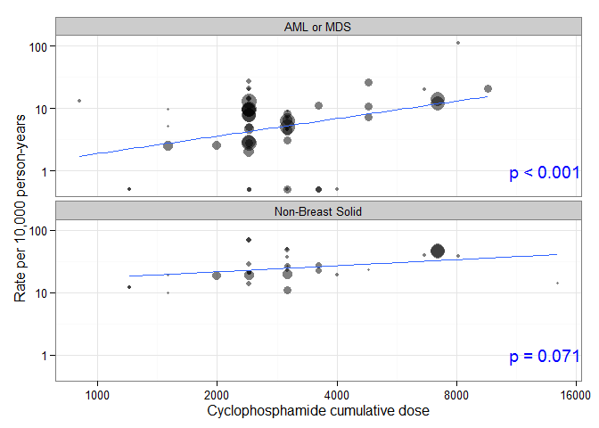
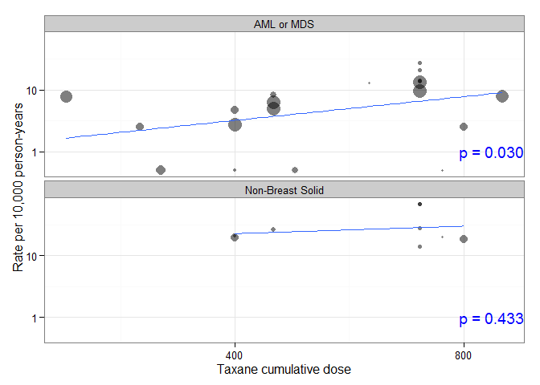
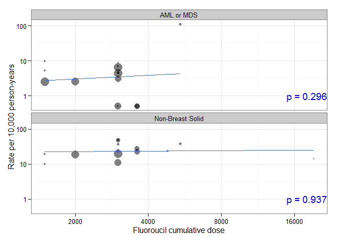

# Secondary Malignancies
[Benjamin Chan](http://careers.stackoverflow.com/benjaminchan)  
`r Sys.time()`  

`source` the R script, `make.R` to generate the project document.

```
> source("make.R")
```


# Load data

Load the data from the Box folder.


```r
setwd("~/GitHub repositories/AEAfterBreastCaACT/SecondaryMalignancies")
list.files()
```

```
##  [1] "AnthracyclineCumulativeDose.csv"                              
##  [2] "AnthracyclineCumulativeDose.png"                              
##  [3] "CyclophosphamideCumulativeDose.csv"                           
##  [4] "CyclophosphamideCumulativeDose.png"                           
##  [5] "FluoroucilCumulativeDose.csv"                                 
##  [6] "FluoroucilCumulativeDose.png"                                 
##  [7] "make.R"                                                       
##  [8] "metaregSecMal.html"                                           
##  [9] "metaregSecMal.md"                                             
## [10] "metaregSecMal.Rmd"                                            
## [11] "metaregSecMal_files"                                          
## [12] "NCI Systematic Review - Secondary Malignancies - Shortcut.lnk"
## [13] "regimens.md"                                                  
## [14] "script.R"                                                     
## [15] "SecMal.RData"                                                 
## [16] "SecondaryMalignancies.rproj"                                  
## [17] "SecondaryMalignancies.rxproj"                                 
## [18] "SecondaryMalignancies.sln"                                    
## [19] "summaryRegimens.md"                                           
## [20] "TaxaneCumulativeDose.csv"                                     
## [21] "TaxaneCumulativeDose.png"
```

```r
library(openxlsx)
library(data.table)
pathBox <- "C:/Users/chanb/Box Sync/NCI Systematic Review - Secondary Malignancies"
f <- file.path(pathBox, "SecondaryMalignancies_Data_BG_3_4.xlsx")
sheets <- getSheetNames(f)
sheets
```

```
## [1] "Results"                 "BaselineCharacteristics"
```

```r
D <- read.xlsx(f, sheet = sheets[1], startRow = 3, colNames = FALSE)
D <- data.table(D)
oldnames <- names(D)
newnames <- c("id",
              "authorYear",
              "trial",
              "quality",
              "arm",
              "nRandomized",
              "nITT",
              # "pctCompletingTx",
              "medianFU",
              "regimen",
              "anthracyclineType",
              "anthracyclineTotalDose",
              "anthracyclineDuration",
              "anthracyclineCourses",
              "cyclophosphamideDose",
              "cyclophosphamideDuration",
              "cyclophosphamideCourses",
              "taxaneType",
              "taxaneTotalDose",
              "taxaneDuration",
              "taxaneCourses",
              "fluoroucilTotalDose",
              "fluoroucilDuration",
              "fluoroucilCourses",
              "otherTxDetails",
              "malAML",
              "malMDS",
              "malAMLOrMDS",
              "malNonBreastSolid",
              "malNonBreastSolidType",
              "malOtherBloodCancers",
              "malSMRelatedDeaths",
              "malSecondPrimary",
              "NOTES")
setnames(D, oldnames, newnames[1:33])
```

# Tidy data

Create a `rowid` variable.
This will be handy later.


```r
D[, rowid := .I]
```

Input missing data for Bergh (2000); row was split.


```r
col <- grep("^cyclophosphamide", names(D), invert = TRUE)
D[11, col] <- D[10, col, with = FALSE]
# D[11, ]
# D[10, ]
```

Fix trial column for Romond (2005).


```r
D[grep("Romond", authorYear), trial := gsub("&N", "& N", trial)]
```

Make `medianFU` numeric.


```r
D <- D[grep("-", medianFU, invert = TRUE), medianFUNum := round(as.numeric(medianFU), digits = 2)]
x <- D[grep("-", medianFU), medianFU]
x <- as.numeric(unlist(strsplit(x, "-")))
x1 <- x[seq(1, length(x), 2)]
x2 <- x[seq(2, length(x), 2)]
xbar <- rowMeans(cbind(x1, x2))
D <- D[grep("-", medianFU), medianFUNum := xbar]
D <- D[,
       `:=` (medianFUChar = medianFU,
             medianFU = medianFUNum,
             medianFUNum = NULL)]
unique(D[, .(medianFU, medianFUChar)])
```

```
##     medianFU       medianFUChar
##  1:     26.2               26.2
##  2:    190.8              190.8
##  3:     55.2               55.2
##  4:     38.3 38.299999999999997
##  5:     73.0              71-75
##  6:     36.0                 36
##  7:    124.8              124.8
##  8:     62.5               62.5
##  9:     79.5               79.5
## 10:     77.0                 77
## 11:     64.0                 64
## 12:     69.0                 69
## 13:     62.0                 62
## 14:     65.0                 65
## 15:     60.0                 60
## 16:    131.0                131
## 17:     72.0                 72
## 18:     78.0                 78
## 19:     57.6               57.6
## 20:     58.0                 58
## 21:     69.3               69.3
## 22:    124.0                124
## 23:     59.0                 59
## 24:     86.4               86.4
## 25:    110.0                110
## 26:     99.6 99.600000000000009
## 27:     99.6               99.6
## 28:     63.3               63.3
## 29:     70.0                 70
## 30:     83.0                 83
## 31:       NA                 NA
## 32:     28.8 28.799999999999997
## 33:     28.8               28.8
## 34:     73.2               73.2
## 35:     84.0                 84
## 36:    108.0                108
##     medianFU       medianFUChar
```

```r
D <- D[, medianFUChar := NULL]
```

Recode mal* values of `NR` and `-` to `NA`.


```r
recode <- function(x) {
    missval <- c("-", "NR", " ")
    vec <- D[, get(x)]
    vec[vec %in% missval] <- NA
    vec
}
col <- grep("^mal", names(D), value = TRUE)
for (i in 1:length(col)) {
    D[, col[i]] <- recode(col[i])
}
```

Substitute non-numeric text in mal* values.


```r
substitute <- function(x) {
    vec <- D[, get(x)]
    vec <- gsub("[[:alpha:]]", "", vec)
    vec
}
col <- grep("^mal", names(D), value = TRUE)
for (i in 1:4) {
    # Only substitute a subset of mal* columns
    D[, col[i]] <- substitute(col[i])
}
```

Convert mal* values to numeric.


```r
for (i in 1:4) {
    # Only convert a subset of mal* columns
    D <- D[, col[i] := as.numeric(get(col[i]))]
}
```

The `malAMLOrMDS` column, as entered, captures number of AML or MDS malignancies if the study reported them grouped as opposed to separately.
If the study reported them as separately, then these counts are captures in the `malAML` and `malMDS` columns.
I.e., the `malAML`, `malMDS`, and `malAMLOrMDS` columns are mutually exclusive counts.
We want to create another column, `malAMLOrMDSTotal`, to be non-mutually exclusive from `malAML`, `malMDS`, and `malAMLOrMDS`.
If none of the `malAML`, `malMDS`, and `malAMLOrMDS` values are populated, then set `malAMLOrMDSTotal` to `NA`, also.
NOTE: Couldn't get this to work: [http://stackoverflow.com/a/16513949/1427069](http://stackoverflow.com/a/16513949/1427069).


```r
s <- sample(D[, rowid], 12)
malAMLOrMDSTotal <- rowSums(D[, .(malAML, malMDS, malAMLOrMDS)], na.rm=TRUE)
D <- D[, malAMLOrMDSTotal := malAMLOrMDSTotal]
D <- D[is.na(malAML) & is.na(malMDS) & is.na(malAMLOrMDS), malAMLOrMDSTotal := NA]
D[s, .(rowid, malAML, malMDS, malAMLOrMDS, malAMLOrMDSTotal)]
```

```
##     rowid malAML malMDS malAMLOrMDS malAMLOrMDSTotal
##  1:    83     NA     NA           5                5
##  2:    78     NA     NA          NA               NA
##  3:    95      0     NA          NA                0
##  4:    90     NA     NA          NA               NA
##  5:    89     NA     NA          NA               NA
##  6:    52      1      1          NA                2
##  7:    59      9      4          NA               13
##  8:    34      0      1          NA                1
##  9:    27     NA     NA          NA               NA
## 10:    38      1     NA          NA                1
## 11:    49     NA     NA          NA               NA
## 12:    73     NA     NA           2                2
```

Remove text from `nITT` column.


```r
D <- D[authorYear == "Misset (1996)" & arm == 2, nITT := "137"]
D <- D[authorYear == "Fumoleu (2003)" & arm == 1, nITT := "210"]
D <- D[authorYear == "Fumoleu (2003)" & arm == 2, nITT := "197"]
D <- D[authorYear == "Fumoleu (2003)" & arm == 3, nITT := "195"]
D <- D[, nITT := as.integer(nITT)]
```

Clean up the `regimen` and `dose` columns.


```r
D <- D[, regimen := gsub("\\s$", "", regimen)]
D <- D[, regimen := gsub("\\r\\n", " ", regimen)]
doseVar <- grep("dose", names(D), ignore.case = TRUE, value = TRUE)
for (i in 1:length(doseVar)) {
    D <- D[, doseVar[i] := gsub("\\r\\n", " ", get(doseVar[i]))]
}
D[, .N, c("regimen", doseVar), with = TRUE][order(regimen)]
```

```
##           regimen anthracyclineTotalDose cyclophosphamideDose
##  1:      3 FEC 50                     50                  500
##  2:           A-C                     81                 2400
##  3:         A-CMF                     75                   NA
##  4:         A-T-C                     60                  600
##  5:       A-T-CMF                     75                   NA
##  6:            AC                     60                  600
##  7:            AC                     60                 1200
##  8:            AC                     60                 2400
##  9:            AC             60, 75, 90                  600
## 10:            AC                     54                 1200
## 11:            AC                     80                  600
## 12:        AC-CMF                     60                  600
## 13:        AC-CMF                 60\n90                  600
## 14:          AC-T                     60                  600
## 15:          AC-T             60, 75, 90                  600
## 16:          AC-T                     60                  600
## 17:          AC-T                     60                  600
## 18:          AC-T                     NA                   NA
## 19:    AC-T+Trast                     NA                   NA
## 20:    AC-T-Trast                     NA                   NA
## 21:         AC-TG                     60                  600
## 22:        AC-Tam                     60                  600
## 23:           ACT                     80                  300
## 24:           ACT                     50                  500
## 25:   ACT-T-Trast                     60                  600
## 26:            AT                     60                   NA
## 27:        AT-CMF                     50                   NA
## 28:          AVCF                     30                 1200
## 29:           CMF                     NA                   NA
## 30:       CMF-Tam                     NA                   NA
## 31:         E+Vnr                     50                   NA
## 32:         E-CMF                    110                   NA
## 33:       E-T-CMF                    110                   NA
## 34:            EC                     60                  500
## 35:            EC                    100                  830
## 36:            EC                    120                  600
## 37:            EC                    200                 4???
## 38:          EC-T                     90                  600
## 39:          EC-T                     90                  600
## 40:       EPI-Tam                     90                   NA
## 41:       EPI-Tam                    100                   NA
## 42:           FAC                     50                  500
## 43:         FAC-T                     50                  500
## 44:           FEC                     60                  600
## 45:           FEC                    100                  500
## 46:           FEC                     50                  600
## 47:           FEC                     50                 1200
## 48:           FEC                     50                  500
## 49:     FEC\nCTCb                     60                  600
## 50:     FEC\nCTCb                     60                 1200
## 51: FEC\nTailored           75\n(38-120)      900\n(450-1800)
## 52:       FEC 100                    100                  500
## 53:        FEC 50                     50                  500
## 54:        FEC 75                     75                  500
## 55:         FEC-T                    100                  500
## 56:         FEC-T                     90                  600
## 57:        Neo-AC                     60                  600
## 58:             T                     NA                   NA
## 59:          T-EC                    120                  600
## 60:         T-FEC                     75                  600
## 61:           TAC                     50                  500
## 62:        TX-CEX                     75                  600
## 63:     Tamoxifen                     NA                   NA
##           regimen anthracyclineTotalDose cyclophosphamideDose
##     taxaneTotalDose        fluoroucilTotalDose N
##  1:              NA                        500 1
##  2:              NA                         NA 1
##  3:              NA                         NA 1
##  4:             175                         NA 2
##  5:             100                         NA 1
##  6:              NA                         NA 8
##  7:              NA                         NA 3
##  8:              NA                         NA 2
##  9:              NA                         NA 1
## 10:              NA                         NA 1
## 11:              NA                         NA 1
## 12:              NA                         NA 2
## 13:              NA                         NA 1
## 14:             175                         NA 4
## 15:             175                         NA 1
## 16:             225                         NA 1
## 17:             100                         NA 1
## 18:              NA                         NA 1
## 19:              NA                         NA 1
## 20:              NA                         NA 1
## 21:             175                         NA 1
## 22:              NA                         NA 1
## 23:             200                         NA 1
## 24:              75                         NA 1
## 25:             175                         NA 1
## 26:              60                         NA 1
## 27:              75                         NA 1
## 28:              NA                       1600 1
## 29:              NA                         NA 7
## 30:              NA                         NA 1
## 31:              NA                         NA 1
## 32:              NA                         NA 1
## 33:             250                         NA 1
## 34:              NA                         NA 1
## 35:              NA                         NA 1
## 36:              NA                         NA 1
## 37:              NA                         NA 1
## 38:             175                         NA 2
## 39:             100                         NA 1
## 40:              NA                         NA 1
## 41:              NA                         NA 1
## 42:              NA                        500 3
## 43:             100                        500 1
## 44:              NA                        600 2
## 45:              NA                        500 3
## 46:              NA                        600 1
## 47:              NA                       1200 1
## 48:              NA                        500 1
## 49:              NA                         NA 1
## 50:              NA                         NA 1
## 51:              NA             600\n(300-600) 1
## 52:              NA                        500 1
## 53:              NA                        500 2
## 54:              NA                        500 1
## 55:             100                        500 1
## 56:             175                        600 2
## 57:              NA                         NA 1
## 58:              80                         NA 2
## 59:             100                         NA 1
## 60:              80                        600 1
## 61:              75                         NA 3
## 62:              60 Include capecitabine here? 1
## 63:              NA                         NA 3
##     taxaneTotalDose        fluoroucilTotalDose N
```

```r
write.table(D[, .N, c("regimen", doseVar), with = TRUE][order(regimen)],
            file = "regimens.md",
            sep = " | ", quote = FALSE,
            row.names = FALSE)
```

Calculate cumulative dose: total dose * number of courses.


```r
D <- D[, anthracyclineTotalDose := as.numeric(anthracyclineTotalDose)]
```

```
## Warning: NAs introduced by coercion
```

```r
D <- D[authorYear == "Bergh (2000)" & regimen == "FEC\nTailored", anthracyclineTotalDose := 75]
D <- D[authorYear == "Henderson (2003)", anthracyclineTotalDose := 75]
D <- D[authorYear == "Colleoni (2009)" & regimen == "AC-CMF", anthracyclineTotalDose := 75]
D <- D[, cyclophosphamideDose := as.numeric(cyclophosphamideDose)]
```

```
## Warning: NAs introduced by coercion
```

```r
D <- D[authorYear == "Bergh (2000)" & regimen == "FEC\nTailored", cyclophosphamideDose := 900]
D <- D[authorYear == "Henderson (2003)", anthracyclineTotalDose := 75]
D <- D[, taxaneCourses := as.numeric(taxaneCourses)]
```

```
## Warning: NAs introduced by coercion
```

```r
D <- D[authorYear == "Shulman (2014)" & regimen == "T" & arm == 3, taxaneCourses := 4]
D <- D[authorYear == "Shulman (2014)" & regimen == "T" & arm == 4, taxaneCourses := 6]
D <- D[, fluoroucilTotalDose := as.numeric(fluoroucilTotalDose)]
```

```
## Warning: NAs introduced by coercion
```

```r
D <- D[authorYear == "Bergh (2000)" & regimen == "FEC\nTailored", fluoroucilTotalDose := 600]
D <- D[authorYear == "Joensuu (2012)" & regimen == "TX-CEX", fluoroucilTotalDose := NA]
D <- D[,
       `:=` (anthracyclineCumulDose = anthracyclineTotalDose * anthracyclineCourses,
             cyclophosphamideCumulDose = cyclophosphamideDose * cyclophosphamideCourses,
             taxaneCumulDose = as.numeric(taxaneTotalDose) * taxaneCourses,
             fluoroucilCumulDose = fluoroucilTotalDose * fluoroucilCourses)]
D[, .(authorYear, regimen, anthracyclineCumulDose, anthracyclineTotalDose, anthracyclineCourses)]
```

```
##               authorYear       regimen anthracyclineCumulDose
##  1:        Fisher (1990)            AC                    240
##  2:        Fisher (1990)        AC-CMF                    240
##  3:        Fisher (1990)           CMF                     NA
##  4:        Misset (1996)           CMF                     NA
##  5:        Misset (1996)          AVCF                    360
##  6:        Fisher (1999)            AC                    240
##  7:        Fisher (1999)            AC                    240
##  8:        Fisher (1999)            AC                    240
##  9:         Bergh (2000) FEC\nTailored                    675
## 10:         Bergh (2000)     FEC\nCTCb                    180
## 11:         Bergh (2000)     FEC\nCTCb                    180
## 12: Bernard-Marty (2003)           CMF                     NA
## 13: Bernard-Marty (2003)            EC                    480
## 14: Bernard-Marty (2003)            EC                    800
## 15:        Citron (2003)         A-T-C                    240
## 16:        Citron (2003)         A-T-C                    240
## 17:        Citron (2003)          AC-T                    240
## 18:        Citron (2003)          AC-T                    240
## 19:     Venturini (2005)           FEC                    360
## 20:     Venturini (2005)           FEC                    360
## 21:       Francis (2008)         A-CMF                    300
## 22:       Francis (2008)        AC-CMF                    240
## 23:       Francis (2008)       A-T-CMF                    225
## 24:       Francis (2008)        AT-CMF                    200
## 25:     Goldstein (2008)            AT                    240
## 26:     Goldstein (2008)            AC                    240
## 27:        Martin (2010)           TAC                    300
## 28:        Martin (2010)           FAC                    300
## 29:          Vici (2012)            EC                    480
## 30:          Vici (2012)          T-EC                    480
## 31:     Henderson (2003)            AC                    300
## 32:     Henderson (2003)          AC-T                    300
## 33:    Fountzilas (2005)       E-T-CMF                    330
## 34:    Fountzilas (2005)         E-CMF                    440
## 35:      Mamounas (2005)            AC                    240
## 36:      Mamounas (2005)          AC-T                    240
## 37:         Roche (2006)           FEC                    600
## 38:         Roche (2006)         FEC-T                    300
## 39:       Fumoleu (2003)        FEC 50                    300
## 40:       Fumoleu (2003)      3 FEC 50                    150
## 41:       Fumoleu (2003)        FEC 75                    225
## 42:       Fargeot (2004)     Tamoxifen                     NA
## 43:       Fargeot (2004)       EPI-Tam                    540
## 44:       Kerbrat (2007)           FEC                    600
## 45:       Kerbrat (2007)         E+Vnr                    300
## 46:          Wils (1999)       EPI-Tam                    600
## 47:          Wils (1999)     Tamoxifen                     NA
## 48:       Coombes (1996)           CMF                     NA
## 49:       Coombes (1996)           CMF                     NA
## 50:       Coombes (1996)           FEC                    400
## 51:       Coombes (1996)           FEC                    300
## 52:        Fisher (1997)            AC                    240
## 53:        Fisher (1997)            AC                    240
## 54:        Fisher (1997)            AC                    240
## 55:        Mackey (2013)           TAC                    300
## 56:        Mackey (2013)           FAC                    300
## 57:       Joensuu (2012)        TX-CEX                    225
## 58:       Joensuu (2012)         T-FEC                    225
## 59:        Linden (2007)            AC                    324
## 60:        Linden (2007)           A-C                    324
## 61:    Bonneterre (2005)        FEC 50                    300
## 62:    Bonneterre (2005)       FEC 100                    600
## 63:      Colleoni (2009)        AC-CMF                    300
## 64:      Colleoni (2009)            EC                    600
## 65:      Eiermann (2011)          AC-T                    240
## 66:      Eiermann (2011)           TAC                    300
## 67:        Fisher (2001)           CMF                     NA
## 68:        Fisher (2001)       CMF-Tam                     NA
## 69:        Fisher (2001)            AC                    240
## 70:        Fisher (2001)        AC-Tam                    240
## 71:        Martin (2013)         FAC-T                    200
## 72:        Martin (2013)           FAC                    300
## 73:         Moore (2007)           ACT                    240
## 74:         Moore (2007)            AC                    320
## 75:         Roche (2006)     Tamoxifen                     NA
## 76:         Roche (2006)           FEC                    300
## 77:         Perez (2011)          AC-T                     NA
## 78:         Perez (2011)    AC-T+Trast                     NA
## 79:         Perez (2011)    AC-T-Trast                     NA
## 80:        Romond (2005)          AC-T                    240
## 81:        Romond (2005)   ACT-T-Trast                    240
## 82:       Shulman (2014)            AC                    240
## 83:       Shulman (2014)            AC                    360
## 84:       Shulman (2014)             T                     NA
## 85:       Shulman (2014)             T                     NA
## 86:         Swain (2013)           ACT                    300
## 87:         Swain (2013)          AC-T                    240
## 88:         Swain (2013)         AC-TG                    240
## 89:    Del Mastro (2015)          EC-T                    360
## 90:    Del Mastro (2015)         FEC-T                    360
## 91:    Del Mastro (2015)          EC-T                    360
## 92:    Del Mastro (2015)         FEC-T                    360
## 93:           Nitz (2014          EC-T                    360
## 94:           Nitz (2014           FEC                    600
## 95:           Nitz (2014           CMF                     NA
## 96:        Wolmark, 2001            AC                    240
## 97:        Wolmark, 2001        Neo-AC                    240
##               authorYear       regimen anthracyclineCumulDose
##     anthracyclineTotalDose anthracyclineCourses
##  1:                     60                    4
##  2:                     60                    4
##  3:                     NA                   NA
##  4:                     NA                   NA
##  5:                     30                   12
##  6:                     60                    4
##  7:                     60                    4
##  8:                     60                    4
##  9:                     75                    9
## 10:                     60                    3
## 11:                     60                    3
## 12:                     NA                   NA
## 13:                     60                    8
## 14:                    100                    8
## 15:                     60                    4
## 16:                     60                    4
## 17:                     60                    4
## 18:                     60                    4
## 19:                     60                    6
## 20:                     60                    6
## 21:                     75                    4
## 22:                     60                    4
## 23:                     75                    3
## 24:                     50                    4
## 25:                     60                    4
## 26:                     60                    4
## 27:                     50                    6
## 28:                     50                    6
## 29:                    120                    4
## 30:                    120                    4
## 31:                     75                    4
## 32:                     75                    4
## 33:                    110                    3
## 34:                    110                    4
## 35:                     60                    4
## 36:                     60                    4
## 37:                    100                    6
## 38:                    100                    3
## 39:                     50                    6
## 40:                     50                    3
## 41:                     75                    3
## 42:                     NA                   NA
## 43:                     90                    6
## 44:                    100                    6
## 45:                     50                    6
## 46:                    100                    6
## 47:                     NA                   NA
## 48:                     NA                   NA
## 49:                     NA                   NA
## 50:                     50                    8
## 51:                     50                    6
## 52:                     60                    4
## 53:                     60                    4
## 54:                     60                    4
## 55:                     50                    6
## 56:                     50                    6
## 57:                     75                    3
## 58:                     75                    3
## 59:                     54                    6
## 60:                     81                    4
## 61:                     50                    6
## 62:                    100                    6
## 63:                     75                    4
## 64:                    200                    3
## 65:                     60                    4
## 66:                     50                    6
## 67:                     NA                   NA
## 68:                     NA                   NA
## 69:                     60                    4
## 70:                     60                    4
## 71:                     50                    4
## 72:                     50                    6
## 73:                     80                    3
## 74:                     80                    4
## 75:                     NA                   NA
## 76:                     50                    6
## 77:                     NA                   NA
## 78:                     NA                   NA
## 79:                     NA                   NA
## 80:                     60                    4
## 81:                     60                    4
## 82:                     60                    4
## 83:                     60                    6
## 84:                     NA                   NA
## 85:                     NA                   NA
## 86:                     50                    6
## 87:                     60                    4
## 88:                     60                    4
## 89:                     90                    4
## 90:                     90                    4
## 91:                     90                    4
## 92:                     90                    4
## 93:                     90                    4
## 94:                    100                    6
## 95:                     NA                   NA
## 96:                     60                    4
## 97:                     60                    4
##     anthracyclineTotalDose anthracyclineCourses
```

```r
D[, .(authorYear, regimen, cyclophosphamideCumulDose, cyclophosphamideDose, cyclophosphamideCourses)]
```

```
##               authorYear       regimen cyclophosphamideCumulDose
##  1:        Fisher (1990)            AC                      2400
##  2:        Fisher (1990)        AC-CMF                      2400
##  3:        Fisher (1990)           CMF                        NA
##  4:        Misset (1996)           CMF                        NA
##  5:        Misset (1996)          AVCF                     14400
##  6:        Fisher (1999)            AC                      4800
##  7:        Fisher (1999)            AC                      4800
##  8:        Fisher (1999)            AC                      9600
##  9:         Bergh (2000) FEC\nTailored                      8100
## 10:         Bergh (2000)     FEC\nCTCb                      1200
## 11:         Bergh (2000)     FEC\nCTCb                      1200
## 12: Bernard-Marty (2003)           CMF                        NA
## 13: Bernard-Marty (2003)            EC                      4000
## 14: Bernard-Marty (2003)            EC                      6640
## 15:        Citron (2003)         A-T-C                      2400
## 16:        Citron (2003)         A-T-C                      2400
## 17:        Citron (2003)          AC-T                      2400
## 18:        Citron (2003)          AC-T                      2400
## 19:     Venturini (2005)           FEC                      3600
## 20:     Venturini (2005)           FEC                      3600
## 21:       Francis (2008)         A-CMF                        NA
## 22:       Francis (2008)        AC-CMF                      2400
## 23:       Francis (2008)       A-T-CMF                        NA
## 24:       Francis (2008)        AT-CMF                        NA
## 25:     Goldstein (2008)            AT                        NA
## 26:     Goldstein (2008)            AC                      2400
## 27:        Martin (2010)           TAC                      3000
## 28:        Martin (2010)           FAC                      3000
## 29:          Vici (2012)            EC                      2400
## 30:          Vici (2012)          T-EC                      2400
## 31:     Henderson (2003)            AC                      2400
## 32:     Henderson (2003)          AC-T                      2400
## 33:    Fountzilas (2005)       E-T-CMF                        NA
## 34:    Fountzilas (2005)         E-CMF                        NA
## 35:      Mamounas (2005)            AC                      2400
## 36:      Mamounas (2005)          AC-T                      2400
## 37:         Roche (2006)           FEC                      3000
## 38:         Roche (2006)         FEC-T                      1500
## 39:       Fumoleu (2003)        FEC 50                      3000
## 40:       Fumoleu (2003)      3 FEC 50                      1500
## 41:       Fumoleu (2003)        FEC 75                      1500
## 42:       Fargeot (2004)     Tamoxifen                        NA
## 43:       Fargeot (2004)       EPI-Tam                        NA
## 44:       Kerbrat (2007)           FEC                      3000
## 45:       Kerbrat (2007)         E+Vnr                        NA
## 46:          Wils (1999)       EPI-Tam                        NA
## 47:          Wils (1999)     Tamoxifen                        NA
## 48:       Coombes (1996)           CMF                        NA
## 49:       Coombes (1996)           CMF                        NA
## 50:       Coombes (1996)           FEC                      4800
## 51:       Coombes (1996)           FEC                      7200
## 52:        Fisher (1997)            AC                      2400
## 53:        Fisher (1997)            AC                      2400
## 54:        Fisher (1997)            AC                      4800
## 55:        Mackey (2013)           TAC                      3000
## 56:        Mackey (2013)           FAC                      3000
## 57:       Joensuu (2012)        TX-CEX                      1800
## 58:       Joensuu (2012)         T-FEC                      1800
## 59:        Linden (2007)            AC                      7200
## 60:        Linden (2007)           A-C                      7200
## 61:    Bonneterre (2005)        FEC 50                      3000
## 62:    Bonneterre (2005)       FEC 100                      3000
## 63:      Colleoni (2009)        AC-CMF                      2400
## 64:      Colleoni (2009)            EC                        NA
## 65:      Eiermann (2011)          AC-T                      2400
## 66:      Eiermann (2011)           TAC                      3000
## 67:        Fisher (2001)           CMF                        NA
## 68:        Fisher (2001)       CMF-Tam                        NA
## 69:        Fisher (2001)            AC                      2400
## 70:        Fisher (2001)        AC-Tam                      2400
## 71:        Martin (2013)         FAC-T                      2000
## 72:        Martin (2013)           FAC                      3000
## 73:         Moore (2007)           ACT                       900
## 74:         Moore (2007)            AC                      2400
## 75:         Roche (2006)     Tamoxifen                        NA
## 76:         Roche (2006)           FEC                      3000
## 77:         Perez (2011)          AC-T                        NA
## 78:         Perez (2011)    AC-T+Trast                        NA
## 79:         Perez (2011)    AC-T-Trast                        NA
## 80:        Romond (2005)          AC-T                      2400
## 81:        Romond (2005)   ACT-T-Trast                      2400
## 82:       Shulman (2014)            AC                      2400
## 83:       Shulman (2014)            AC                      3600
## 84:       Shulman (2014)             T                        NA
## 85:       Shulman (2014)             T                        NA
## 86:         Swain (2013)           ACT                      3000
## 87:         Swain (2013)          AC-T                      2400
## 88:         Swain (2013)         AC-TG                      2400
## 89:    Del Mastro (2015)          EC-T                      2400
## 90:    Del Mastro (2015)         FEC-T                      2400
## 91:    Del Mastro (2015)          EC-T                      2400
## 92:    Del Mastro (2015)         FEC-T                      2400
## 93:           Nitz (2014          EC-T                      2400
## 94:           Nitz (2014           FEC                      3000
## 95:           Nitz (2014           CMF                        NA
## 96:        Wolmark, 2001            AC                      2400
## 97:        Wolmark, 2001        Neo-AC                      2400
##               authorYear       regimen cyclophosphamideCumulDose
##     cyclophosphamideDose cyclophosphamideCourses
##  1:                  600                       4
##  2:                  600                       4
##  3:                   NA                      NA
##  4:                   NA                      NA
##  5:                 1200                      12
##  6:                 1200                       4
##  7:                 2400                       2
##  8:                 2400                       4
##  9:                  900                       9
## 10:                  600                       2
## 11:                 1200                       1
## 12:                   NA                      NA
## 13:                  500                       8
## 14:                  830                       8
## 15:                  600                       4
## 16:                  600                       4
## 17:                  600                       4
## 18:                  600                       4
## 19:                  600                       6
## 20:                  600                       6
## 21:                   NA                      NA
## 22:                  600                       4
## 23:                   NA                      NA
## 24:                   NA                      NA
## 25:                   NA                      NA
## 26:                  600                       4
## 27:                  500                       6
## 28:                  500                       6
## 29:                  600                       4
## 30:                  600                       4
## 31:                  600                       4
## 32:                  600                       4
## 33:                   NA                      NA
## 34:                   NA                      NA
## 35:                  600                       4
## 36:                  600                       4
## 37:                  500                       6
## 38:                  500                       3
## 39:                  500                       6
## 40:                  500                       3
## 41:                  500                       3
## 42:                   NA                      NA
## 43:                   NA                      NA
## 44:                  500                       6
## 45:                   NA                      NA
## 46:                   NA                      NA
## 47:                   NA                      NA
## 48:                   NA                      NA
## 49:                   NA                      NA
## 50:                  600                       8
## 51:                 1200                       6
## 52:                  600                       4
## 53:                 1200                       2
## 54:                 1200                       4
## 55:                  500                       6
## 56:                  500                       6
## 57:                  600                       3
## 58:                  600                       3
## 59:                 1200                       6
## 60:                 2400                       3
## 61:                  500                       6
## 62:                  500                       6
## 63:                  600                       4
## 64:                   NA                       3
## 65:                  600                       4
## 66:                  500                       6
## 67:                   NA                      NA
## 68:                   NA                      NA
## 69:                  600                       4
## 70:                  600                       4
## 71:                  500                       4
## 72:                  500                       6
## 73:                  300                       3
## 74:                  600                       4
## 75:                   NA                      NA
## 76:                  500                       6
## 77:                   NA                      NA
## 78:                   NA                      NA
## 79:                   NA                      NA
## 80:                  600                       4
## 81:                  600                       4
## 82:                  600                       4
## 83:                  600                       6
## 84:                   NA                      NA
## 85:                   NA                      NA
## 86:                  500                       6
## 87:                  600                       4
## 88:                  600                       4
## 89:                  600                       4
## 90:                  600                       4
## 91:                  600                       4
## 92:                  600                       4
## 93:                  600                       4
## 94:                  500                       6
## 95:                   NA                      NA
## 96:                  600                       4
## 97:                  600                       4
##     cyclophosphamideDose cyclophosphamideCourses
```

```r
D[, .(authorYear, regimen, taxaneCumulDose, taxaneTotalDose, taxaneCourses)]
```

```
##               authorYear       regimen taxaneCumulDose taxaneTotalDose
##  1:        Fisher (1990)            AC              NA              NA
##  2:        Fisher (1990)        AC-CMF              NA              NA
##  3:        Fisher (1990)           CMF              NA              NA
##  4:        Misset (1996)           CMF              NA              NA
##  5:        Misset (1996)          AVCF              NA              NA
##  6:        Fisher (1999)            AC              NA              NA
##  7:        Fisher (1999)            AC              NA              NA
##  8:        Fisher (1999)            AC              NA              NA
##  9:         Bergh (2000) FEC\nTailored              NA              NA
## 10:         Bergh (2000)     FEC\nCTCb              NA              NA
## 11:         Bergh (2000)     FEC\nCTCb              NA              NA
## 12: Bernard-Marty (2003)           CMF              NA              NA
## 13: Bernard-Marty (2003)            EC              NA              NA
## 14: Bernard-Marty (2003)            EC              NA              NA
## 15:        Citron (2003)         A-T-C             700             175
## 16:        Citron (2003)         A-T-C             700             175
## 17:        Citron (2003)          AC-T             700             175
## 18:        Citron (2003)          AC-T             700             175
## 19:     Venturini (2005)           FEC              NA              NA
## 20:     Venturini (2005)           FEC              NA              NA
## 21:       Francis (2008)         A-CMF              NA              NA
## 22:       Francis (2008)        AC-CMF              NA              NA
## 23:       Francis (2008)       A-T-CMF             300             100
## 24:       Francis (2008)        AT-CMF             300              75
## 25:     Goldstein (2008)            AT             240              60
## 26:     Goldstein (2008)            AC              NA              NA
## 27:        Martin (2010)           TAC             450              75
## 28:        Martin (2010)           FAC              NA              NA
## 29:          Vici (2012)            EC              NA              NA
## 30:          Vici (2012)          T-EC             400             100
## 31:     Henderson (2003)            AC              NA              NA
## 32:     Henderson (2003)          AC-T              NA             175
## 33:    Fountzilas (2005)       E-T-CMF             750             250
## 34:    Fountzilas (2005)         E-CMF              NA              NA
## 35:      Mamounas (2005)            AC              NA              NA
## 36:      Mamounas (2005)          AC-T             900             225
## 37:         Roche (2006)           FEC              NA              NA
## 38:         Roche (2006)         FEC-T             300             100
## 39:       Fumoleu (2003)        FEC 50              NA              NA
## 40:       Fumoleu (2003)      3 FEC 50              NA              NA
## 41:       Fumoleu (2003)        FEC 75              NA              NA
## 42:       Fargeot (2004)     Tamoxifen              NA              NA
## 43:       Fargeot (2004)       EPI-Tam              NA              NA
## 44:       Kerbrat (2007)           FEC              NA              NA
## 45:       Kerbrat (2007)         E+Vnr              NA              NA
## 46:          Wils (1999)       EPI-Tam              NA              NA
## 47:          Wils (1999)     Tamoxifen              NA              NA
## 48:       Coombes (1996)           CMF              NA              NA
## 49:       Coombes (1996)           CMF              NA              NA
## 50:       Coombes (1996)           FEC              NA              NA
## 51:       Coombes (1996)           FEC              NA              NA
## 52:        Fisher (1997)            AC              NA              NA
## 53:        Fisher (1997)            AC              NA              NA
## 54:        Fisher (1997)            AC              NA              NA
## 55:        Mackey (2013)           TAC             450              75
## 56:        Mackey (2013)           FAC              NA              NA
## 57:       Joensuu (2012)        TX-CEX             180              60
## 58:       Joensuu (2012)         T-FEC             240              80
## 59:        Linden (2007)            AC              NA              NA
## 60:        Linden (2007)           A-C              NA              NA
## 61:    Bonneterre (2005)        FEC 50              NA              NA
## 62:    Bonneterre (2005)       FEC 100              NA              NA
## 63:      Colleoni (2009)        AC-CMF              NA              NA
## 64:      Colleoni (2009)            EC              NA              NA
## 65:      Eiermann (2011)          AC-T             400             100
## 66:      Eiermann (2011)           TAC             450              75
## 67:        Fisher (2001)           CMF              NA              NA
## 68:        Fisher (2001)       CMF-Tam              NA              NA
## 69:        Fisher (2001)            AC              NA              NA
## 70:        Fisher (2001)        AC-Tam              NA              NA
## 71:        Martin (2013)         FAC-T             800             100
## 72:        Martin (2013)           FAC              NA              NA
## 73:         Moore (2007)           ACT             600             200
## 74:         Moore (2007)            AC              NA              NA
## 75:         Roche (2006)     Tamoxifen              NA              NA
## 76:         Roche (2006)           FEC              NA              NA
## 77:         Perez (2011)          AC-T              NA              NA
## 78:         Perez (2011)    AC-T+Trast              NA              NA
## 79:         Perez (2011)    AC-T-Trast              NA              NA
## 80:        Romond (2005)          AC-T             700             175
## 81:        Romond (2005)   ACT-T-Trast             700             175
## 82:       Shulman (2014)            AC              NA              NA
## 83:       Shulman (2014)            AC              NA              NA
## 84:       Shulman (2014)             T             320              80
## 85:       Shulman (2014)             T             480              80
## 86:         Swain (2013)           ACT             450              75
## 87:         Swain (2013)          AC-T             700             175
## 88:         Swain (2013)         AC-TG             700             175
## 89:    Del Mastro (2015)          EC-T             700             175
## 90:    Del Mastro (2015)         FEC-T             700             175
## 91:    Del Mastro (2015)          EC-T             700             175
## 92:    Del Mastro (2015)         FEC-T             700             175
## 93:           Nitz (2014          EC-T             400             100
## 94:           Nitz (2014           FEC              NA              NA
## 95:           Nitz (2014           CMF              NA              NA
## 96:        Wolmark, 2001            AC              NA              NA
## 97:        Wolmark, 2001        Neo-AC              NA              NA
##               authorYear       regimen taxaneCumulDose taxaneTotalDose
##     taxaneCourses
##  1:            NA
##  2:            NA
##  3:            NA
##  4:            NA
##  5:            NA
##  6:            NA
##  7:            NA
##  8:            NA
##  9:            NA
## 10:            NA
## 11:            NA
## 12:            NA
## 13:            NA
## 14:            NA
## 15:             4
## 16:             4
## 17:             4
## 18:             4
## 19:            NA
## 20:            NA
## 21:            NA
## 22:            NA
## 23:             3
## 24:             4
## 25:             4
## 26:            NA
## 27:             6
## 28:            NA
## 29:            NA
## 30:             4
## 31:            NA
## 32:            NA
## 33:             3
## 34:            NA
## 35:            NA
## 36:             4
## 37:            NA
## 38:             3
## 39:            NA
## 40:            NA
## 41:            NA
## 42:            NA
## 43:            NA
## 44:            NA
## 45:            NA
## 46:            NA
## 47:            NA
## 48:            NA
## 49:            NA
## 50:            NA
## 51:            NA
## 52:            NA
## 53:            NA
## 54:            NA
## 55:             6
## 56:            NA
## 57:             3
## 58:             3
## 59:            NA
## 60:            NA
## 61:            NA
## 62:            NA
## 63:            NA
## 64:            NA
## 65:             4
## 66:             6
## 67:            NA
## 68:            NA
## 69:            NA
## 70:            NA
## 71:             8
## 72:            NA
## 73:             3
## 74:            NA
## 75:            NA
## 76:            NA
## 77:            NA
## 78:            NA
## 79:            NA
## 80:             4
## 81:             4
## 82:            NA
## 83:            NA
## 84:             4
## 85:             6
## 86:             6
## 87:             4
## 88:             4
## 89:             4
## 90:             4
## 91:             4
## 92:             4
## 93:             4
## 94:            NA
## 95:            NA
## 96:            NA
## 97:            NA
##     taxaneCourses
```

```r
D[, .(authorYear, regimen, fluoroucilCumulDose, fluoroucilTotalDose, fluoroucilCourses)]
```

```
##               authorYear       regimen fluoroucilCumulDose
##  1:        Fisher (1990)            AC                  NA
##  2:        Fisher (1990)        AC-CMF                  NA
##  3:        Fisher (1990)           CMF                  NA
##  4:        Misset (1996)           CMF                  NA
##  5:        Misset (1996)          AVCF               19200
##  6:        Fisher (1999)            AC                  NA
##  7:        Fisher (1999)            AC                  NA
##  8:        Fisher (1999)            AC                  NA
##  9:         Bergh (2000) FEC\nTailored                5400
## 10:         Bergh (2000)     FEC\nCTCb                  NA
## 11:         Bergh (2000)     FEC\nCTCb                  NA
## 12: Bernard-Marty (2003)           CMF                  NA
## 13: Bernard-Marty (2003)            EC                  NA
## 14: Bernard-Marty (2003)            EC                  NA
## 15:        Citron (2003)         A-T-C                  NA
## 16:        Citron (2003)         A-T-C                  NA
## 17:        Citron (2003)          AC-T                  NA
## 18:        Citron (2003)          AC-T                  NA
## 19:     Venturini (2005)           FEC                3600
## 20:     Venturini (2005)           FEC                3600
## 21:       Francis (2008)         A-CMF                  NA
## 22:       Francis (2008)        AC-CMF                  NA
## 23:       Francis (2008)       A-T-CMF                  NA
## 24:       Francis (2008)        AT-CMF                  NA
## 25:     Goldstein (2008)            AT                  NA
## 26:     Goldstein (2008)            AC                  NA
## 27:        Martin (2010)           TAC                  NA
## 28:        Martin (2010)           FAC                3000
## 29:          Vici (2012)            EC                  NA
## 30:          Vici (2012)          T-EC                  NA
## 31:     Henderson (2003)            AC                  NA
## 32:     Henderson (2003)          AC-T                  NA
## 33:    Fountzilas (2005)       E-T-CMF                  NA
## 34:    Fountzilas (2005)         E-CMF                  NA
## 35:      Mamounas (2005)            AC                  NA
## 36:      Mamounas (2005)          AC-T                  NA
## 37:         Roche (2006)           FEC                3000
## 38:         Roche (2006)         FEC-T                1500
## 39:       Fumoleu (2003)        FEC 50                3000
## 40:       Fumoleu (2003)      3 FEC 50                1500
## 41:       Fumoleu (2003)        FEC 75                1500
## 42:       Fargeot (2004)     Tamoxifen                  NA
## 43:       Fargeot (2004)       EPI-Tam                  NA
## 44:       Kerbrat (2007)           FEC                3000
## 45:       Kerbrat (2007)         E+Vnr                  NA
## 46:          Wils (1999)       EPI-Tam                  NA
## 47:          Wils (1999)     Tamoxifen                  NA
## 48:       Coombes (1996)           CMF                  NA
## 49:       Coombes (1996)           CMF                  NA
## 50:       Coombes (1996)           FEC                4800
## 51:       Coombes (1996)           FEC                7200
## 52:        Fisher (1997)            AC                  NA
## 53:        Fisher (1997)            AC                  NA
## 54:        Fisher (1997)            AC                  NA
## 55:        Mackey (2013)           TAC                  NA
## 56:        Mackey (2013)           FAC                3000
## 57:       Joensuu (2012)        TX-CEX                  NA
## 58:       Joensuu (2012)         T-FEC                1800
## 59:        Linden (2007)            AC                  NA
## 60:        Linden (2007)           A-C                  NA
## 61:    Bonneterre (2005)        FEC 50                3000
## 62:    Bonneterre (2005)       FEC 100                3000
## 63:      Colleoni (2009)        AC-CMF                  NA
## 64:      Colleoni (2009)            EC                  NA
## 65:      Eiermann (2011)          AC-T                  NA
## 66:      Eiermann (2011)           TAC                  NA
## 67:        Fisher (2001)           CMF                  NA
## 68:        Fisher (2001)       CMF-Tam                  NA
## 69:        Fisher (2001)            AC                  NA
## 70:        Fisher (2001)        AC-Tam                  NA
## 71:        Martin (2013)         FAC-T                2000
## 72:        Martin (2013)           FAC                3000
## 73:         Moore (2007)           ACT                  NA
## 74:         Moore (2007)            AC                  NA
## 75:         Roche (2006)     Tamoxifen                  NA
## 76:         Roche (2006)           FEC                3000
## 77:         Perez (2011)          AC-T                  NA
## 78:         Perez (2011)    AC-T+Trast                  NA
## 79:         Perez (2011)    AC-T-Trast                  NA
## 80:        Romond (2005)          AC-T                  NA
## 81:        Romond (2005)   ACT-T-Trast                  NA
## 82:       Shulman (2014)            AC                  NA
## 83:       Shulman (2014)            AC                  NA
## 84:       Shulman (2014)             T                  NA
## 85:       Shulman (2014)             T                  NA
## 86:         Swain (2013)           ACT                  NA
## 87:         Swain (2013)          AC-T                  NA
## 88:         Swain (2013)         AC-TG                  NA
## 89:    Del Mastro (2015)          EC-T                  NA
## 90:    Del Mastro (2015)         FEC-T                2400
## 91:    Del Mastro (2015)          EC-T                  NA
## 92:    Del Mastro (2015)         FEC-T                2400
## 93:           Nitz (2014          EC-T                  NA
## 94:           Nitz (2014           FEC                3000
## 95:           Nitz (2014           CMF                  NA
## 96:        Wolmark, 2001            AC                  NA
## 97:        Wolmark, 2001        Neo-AC                  NA
##               authorYear       regimen fluoroucilCumulDose
##     fluoroucilTotalDose fluoroucilCourses
##  1:                  NA                NA
##  2:                  NA                NA
##  3:                  NA                NA
##  4:                  NA                NA
##  5:                1600                12
##  6:                  NA                NA
##  7:                  NA                NA
##  8:                  NA                NA
##  9:                 600                 9
## 10:                  NA                NA
## 11:                  NA                NA
## 12:                  NA                NA
## 13:                  NA                NA
## 14:                  NA                NA
## 15:                  NA                NA
## 16:                  NA                NA
## 17:                  NA                NA
## 18:                  NA                NA
## 19:                 600                 6
## 20:                 600                 6
## 21:                  NA                NA
## 22:                  NA                NA
## 23:                  NA                NA
## 24:                  NA                NA
## 25:                  NA                NA
## 26:                  NA                NA
## 27:                  NA                NA
## 28:                 500                 6
## 29:                  NA                NA
## 30:                  NA                NA
## 31:                  NA                NA
## 32:                  NA                NA
## 33:                  NA                NA
## 34:                  NA                NA
## 35:                  NA                NA
## 36:                  NA                NA
## 37:                 500                 6
## 38:                 500                 3
## 39:                 500                 6
## 40:                 500                 3
## 41:                 500                 3
## 42:                  NA                NA
## 43:                  NA                NA
## 44:                 500                 6
## 45:                  NA                NA
## 46:                  NA                NA
## 47:                  NA                NA
## 48:                  NA                NA
## 49:                  NA                NA
## 50:                 600                 8
## 51:                1200                 6
## 52:                  NA                NA
## 53:                  NA                NA
## 54:                  NA                NA
## 55:                  NA                NA
## 56:                 500                 6
## 57:                  NA                NA
## 58:                 600                 3
## 59:                  NA                NA
## 60:                  NA                NA
## 61:                 500                 6
## 62:                 500                 6
## 63:                  NA                NA
## 64:                  NA                NA
## 65:                  NA                NA
## 66:                  NA                NA
## 67:                  NA                NA
## 68:                  NA                NA
## 69:                  NA                NA
## 70:                  NA                NA
## 71:                 500                 4
## 72:                 500                 6
## 73:                  NA                NA
## 74:                  NA                NA
## 75:                  NA                NA
## 76:                 500                 6
## 77:                  NA                NA
## 78:                  NA                NA
## 79:                  NA                NA
## 80:                  NA                NA
## 81:                  NA                NA
## 82:                  NA                NA
## 83:                  NA                NA
## 84:                  NA                NA
## 85:                  NA                NA
## 86:                  NA                NA
## 87:                  NA                NA
## 88:                  NA                NA
## 89:                  NA                NA
## 90:                 600                 4
## 91:                  NA                NA
## 92:                 600                 4
## 93:                  NA                NA
## 94:                 500                 6
## 95:                  NA                NA
## 96:                  NA                NA
## 97:                  NA                NA
##     fluoroucilTotalDose fluoroucilCourses
```


# Summarize

Define some functions.


```r
calcPct <- function (x, n) {
  prec <- "%.3g"
  sprintf(paste0(prec, "%%"),
          median(x / n, na.rm = TRUE) * 100)
}
calcRate <- function (x, n, y) {
  prec <- "%.3g"
  py <- 10000
  sprintf(paste(prec, "per %s p-y"),
          median(x / (n * (y / 12)), na.rm=TRUE) * py,
          py)
}
```

Summarize the regimens.


```r
D[,
  `:=`(isAnthra = !is.na(anthracyclineTotalDose),
        isCyclo = !is.na(cyclophosphamideDose),
        isTaxane = !is.na(taxaneTotalDose),
        isFluoro = !is.na(fluoroucilTotalDose))]
D1 <- melt(D,
           id.vars=c("id", "authorYear", "arm",
                     "isAnthra", "anthracyclineCumulDose",
                     "isCyclo", "cyclophosphamideCumulDose",
                     "isTaxane", "taxaneCumulDose",
                     "isFluoro", "fluoroucilCumulDose",
                     "nITT", "medianFU"),
           measure.vars=c("malAML", "malMDS", "malAMLOrMDSTotal", "malNonBreastSolid"),
           value.name="malN",
           variable.name="malType")
D1 <- D1[, malType := gsub("^mal", "", malType)]
D1 <- D1[, malType := factor(malType,
                             levels=c("AML", "MDS", "AMLOrMDSTotal", "NonBreastSolid"),
                             labels=c("AML", "MDS", "AML or MDS", "Non-Breast Solid"))]
D1 <- D1[, py := nITT * (medianFU / 12)]
D1 <- D1[, rate := malN / py * 10000]
summaryRegimens <- D1[,
                      .(totalN = sum(nITT, na.rm = TRUE),
                        totalPersonYears = round(sum(py, na.rm = TRUE)),
                        totalMalignancies = sum(malN, na.rm = TRUE),
                        medianPct = calcPct(malN, nITT),
                        medianRate = calcRate(malN, nITT, medianFU)),
                      .(isAnthra,
                        isCyclo,
                        isTaxane,
                        isFluoro,
                        malType)]
summaryRegimens <- summaryRegimens[order(-isAnthra, -isCyclo, -isTaxane, -isFluoro, malType)]
write.table(summaryRegimens,
            file = "summaryRegimens.md",
            sep = " | ", quote = FALSE,
            row.names = FALSE)
```


# Meta-regression

Estimate meta-regression models for log transformed incidence rate.

Define meta-regression functions.


```r
metareg <- function (D) {
  require(metafor)
  D <- D[!(is.na(x) | is.na(rate) | is.na(nITT) | is.na(malType))]
  M <- rma.glmm(xi = malN, ti = py, mods = log10(x), measure="IRLN", data=D)
  pvalue <- M$pval[which(row.names(M$b) == "mods")]
  if (pvalue < 0.001) {
    pvalue <- "p < 0.001"
  } else {
    pvalue <- sprintf("p = %.03f", pvalue)
  }
  list(rma.glmm = M,
       pvalue = pvalue)
}
plotreg <- function (D, xlab, xbreaks, text) {
  require(ggplot2)
  require(tools)
  D <- D[!(is.na(x) | is.na(rate) | is.na(nITT) | is.na(malType))]
  D <- D[malType %in% c("AML or MDS", "Non-Breast Solid")]
  D <- D[, malType := droplevels(malType)]
  G <- ggplot(D, aes(x=x, y=rate + 1/2, size=nITT / min(nITT, na.rm=TRUE), group=malType))
  G <- G + geom_point(alpha=1/2)
  G <- G + geom_smooth(method="lm", se=FALSE)
  G <- G + geom_text(data=data.frame(x=Inf, y=1, label=text, malType=levels(D[, malType])),
                     aes(x, y, label=label, group=malType), inherit.aes=FALSE, hjust=1, color="blue")
  G <- G + scale_x_log10(xlab, breaks=xbreaks)
  G <- G + scale_y_log10("Rate per 10,000 person-years")
  G <- G + facet_wrap(~ malType, nrow=2, ncol=1)
  G <- G + theme_bw()
  G <- G + theme(legend.position="none")
  filename <- gsub("\\s+", "", toTitleCase(xlab))
  ggsave(filename=sprintf("%s.png", filename))
  write.csv(D, file=sprintf("%s.csv", filename), row.names=FALSE)
  show(file.info(c(sprintf("%s.png", filename), sprintf("%s.csv", filename)))[c("size", "mtime")])
  G
}
```

## Cyclophosphamide


```r
library(metafor)
```

```
## Loading required package: Matrix
## Loading 'metafor' package (version 1.9-8). For an overview 
## and introduction to the package please type: help(metafor).
```

```r
D2 <- D1[isCyclo == TRUE,
         .(id = factor(id),
           authorYear,
           isCyclo,
           x = cyclophosphamideCumulDose,
           nITT,
           medianFU,
           malType,
           malN,
           py,
           rate)]
M1 <- metareg(D2[malType == "AML or MDS"      ])
M2 <- metareg(D2[malType == "Non-Breast Solid"])
pvalues <- c(M1$pvalue, M2$pvalue)
plotreg(D2, "Cyclophosphamide cumulative dose", 1000 * c(0.5, 1, 2, 4, 8, 16), pvalues)
```

```
## Loading required package: ggplot2
## Loading required package: tools
## Saving 7 x 5 in image
```

```
##                                     size               mtime
## CyclophosphamideCumulativeDose.png 43644 2016-05-31 13:15:24
## CyclophosphamideCumulativeDose.csv  6822 2016-05-31 13:15:24
```

 


## Anthracycline


```r
library(metafor)
D2 <- D1[isAnthra == TRUE,
         .(id = factor(id),
           authorYear,
           isAnthra,
           x = anthracyclineCumulDose,
           nITT,
           medianFU,
           malType,
           malN,
           py,
           rate)]
M1 <- metareg(D2[malType == "AML or MDS"      ])
M2 <- metareg(D2[malType == "Non-Breast Solid"])
pvalues <- c(M1$pvalue, M2$pvalue)
plotreg(D2, "Anthracycline cumulative dose", 100 * c(1, 2, 4, 8), pvalues)
```

```
## Saving 7 x 5 in image
```

```
##                                  size               mtime
## AnthracyclineCumulativeDose.png 41946 2016-05-31 13:15:25
## AnthracyclineCumulativeDose.csv  7552 2016-05-31 13:15:25
```

 


## Taxane


```r
library(metafor)
D2 <- D1[isTaxane == TRUE,
         .(id = factor(id),
           authorYear,
           isTaxane,
           x = taxaneCumulDose,
           nITT,
           medianFU,
           malType,
           malN,
           py,
           rate)]
M1 <- metareg(D2[malType == "AML or MDS"      ])
M2 <- metareg(D2[malType == "Non-Breast Solid"])
pvalues <- c(M1$pvalue, M2$pvalue)
plotreg(D2, "Taxane cumulative dose", 100 * c(1, 2, 4, 8), pvalues)
```

```
## Saving 7 x 5 in image
```

```
##                           size               mtime
## TaxaneCumulativeDose.png 36670 2016-05-31 13:15:26
## TaxaneCumulativeDose.csv  2479 2016-05-31 13:15:26
```

 


## Fluoroucil


```r
library(metafor)
D2 <- D1[isFluoro == TRUE,
         .(id = factor(id),
           authorYear,
           isFluoro,
           x = fluoroucilCumulDose,
           nITT,
           medianFU,
           malType,
           malN,
           py,
           rate)]
M1 <- metareg(D2[malType == "AML or MDS"      ])
M2 <- metareg(D2[malType == "Non-Breast Solid"])
pvalues <- c(M1$pvalue, M2$pvalue)
plotreg(D2, "Fluoroucil cumulative dose", 1000 * c(0.5, 1, 2, 4, 8, 16), pvalues)
```

```
## Saving 7 x 5 in image
```

```
##                               size               mtime
## FluoroucilCumulativeDose.png 41358 2016-05-31 13:15:28
## FluoroucilCumulativeDose.csv  2750 2016-05-31 13:15:28
```

 


# More stuff I'm not sure I need


```r
D3 <- D[isAnthra == TRUE & isCyclo == TRUE & isTaxane == FALSE & isFluoro == FALSE,
       .(isAnthra,
         isCyclo,
         isTaxane,
         isFluoro,
         malAML,
         nITT,
         medianFU,
         propAML = malAML / nITT,
         rateAML = malAML / medianFU)]
D3 <- D3[, medianPropAML := median(propAML, na.rm = TRUE)]
D3

# Hold the 1st sheet
D1 <- D

# Read the 2nd sheet
D <- read.xlsx(f, sheet = sheets[2], startRow = 1, colNames = TRUE)
D <- data.table(D)
oldnames <- names(D)
newnames <- c("id",
              "authorYear",
              "trial",
              "quality",
              "arm",
              "nRandomized",
              "nITT",
              "age",
              "menopausalStatus",
              "surgery",
              "tamoxifen",
              "tumorStage",
              "tumorSize",
              "nodalStatus",
              "hrStatus")
setnames(D, oldnames, newnames)


# Tidy data

# Input missing data for Bergh (2000); year is missing a digit
D[, authorYear := gsub("Bergh \\(200\\)", "Bergh \\(2000\\)", authorYear)]

# Recode values of "NR" and "-" to NA
D[, "menopausalStatus"] <- recode("menopausalStatus")
D[, "surgery"] <- recode("surgery")
D[, "tamoxifen"] <- recode("tamoxifen")
D[, "tumorStage"] <- recode("tumorStage")
D[, "tumorSize"] <- recode("tumorSize")
D[, "nodalStatus"] <- recode("nodalStatus")
D[, "hrStatus"] <- recode("hrStatus")


# Hold the 2nd sheet
D2 <- D


# Merge sheets
keyVar <- c("id", "authorYear", "arm")
D1 <- D1[, in1 := TRUE]
D2 <- D2[, in2 := TRUE]
setkeyv(D1, keyVar)
setkeyv(D2, keyVar)
D2 <- D2[,
         `:=` (trial = NULL,
               quality = NULL,
               nRandomized = NULL,
               nITT = NULL)]
D <- merge(D1, D2, all = TRUE)
D[is.na(in1) | is.na(in2), .(id, authorYear, arm, trial, in1, in2)]


# Save to RData
save(D, file = "SecMal.RData")
file.info("SecMal.RData")
load("SecMal.RData")
```
